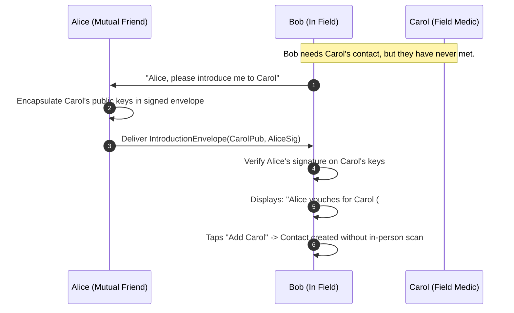

# GHOST Protocol — v0.3 Specification: Protest Mode & Frictionless Contact Discovery

> **Target Release:** v0.3.0  
> **Status:** Approved Architectural Specification  
> **Category:** Identity, Discovery & Real-World Usability  
> **Last Updated:** 2026-09-03  

---

## 1. Executive Summary & The Product Reality

GHOST v0.1.5 and v0.2 established an uncompromising cryptographic baseline: **zero trust-on-first-use (TOFU), zero central servers, zero metadata leakage, and QR-only in-person key exchange**. By forcing users to scan a 64-byte cryptographic QR code face-to-face, GHOST completely eliminates Man-in-the-Middle (MITM) attacks and persistent public tracking.

**However, this creates a critical usability failure in hostile, dynamic environments:**

| Scenario | What GHOST Currently Demands | What Real-World Users Need |
|---|---|---|
| **Protest under police kettling** | Stop running, wipe tear gas/dirt from screen, open app, align cameras 10cm apart, wait for ZXing parse (30s) | Instant 3-second alert to someone 10m away: *"Police incoming from North"* |
| **Earthquake / Disaster zone** | Cracked screen, dust, rubble, panic; camera alignment fails | Coordinate search and rescue without touch-screen alignment ritual |
| **Rapid Transit / Flight** | Awkward physical camera pointing in crowded seating | Automatic nearby discovery with one-tap consent |
| **Dense Crowd / Festival** | Loud music, moving crowd, cannot hold phones steady | Verbal 4-word code shouted across the space or written on a sign |

> [!IMPORTANT]
> **Core Principle:** *Privacy without usability is fatal in survival scenarios.* If an activist cannot establish a secure link with a peer because both are fleeing a tear gas canister, the cryptographic security of the app is irrelevant.

To bridge the gap between cryptographic purity and real-world survival, GHOST v0.3 introduces **"Protest Mode"**: a consent-based, friction-reduced discovery suite that maintains strict metadata privacy while slashing connection latency from 30+ seconds to **under 3 seconds**.

---

## 2. Competitive Landscape & Trade-off Matrix

Existing decentralized mesh apps choose different points along the security-usability spectrum:

```
[Zero Privacy / Total Frictionless]                               [Maximum Privacy / Maximum Friction]
        Bridgefy ────────────── Briar ────────────── BitChat ────────────── GHOST (v0.1.5)
      (Auto-add all)        (Local Forums)       (Nostr npub)           (QR Scan Only)
                                                      │
                                                      ▼
                                            GHOST v0.3 Protest Mode
                                         (One-Tap Consent + Ephemeral)
```

| Dimension | **Bridgefy** | **Briar** | **BitChat** | **GHOST v0.1.5** | **GHOST v0.3 (Protest Mode)** |
|---|---|---|---|---|---|
| **Discovery Mechanism** | Automatic contact add within BLE range | Local Bluetooth peer discovery + unauthenticated local forums | Nostr `npub` public key strings or QR codes | Physical QR code camera scan only | **Nearby BLE beacon + One-tap mutual consent + 24h short codes** |
| **MITM Resistance** | Poor (open to spoofing) | High (QR code verification) | Moderate (trusts relays/npub) | **Absolute** (in-person cryptographic QR) | **High** (out-of-band ephemeral code or two-way consent handshake) |
| **Public Tracking Risk** | High (static IDs broadcasted) | None (Tor/local BLE) | **High** (persistent public `npub` tracked across public Nostr relays) | **None** (ephemeral 4-byte fingerprint) | **None** (ephemeral rotated 4-byte fingerprint; no global relay logging) |
| **Spam / Griefing** | Extreme (anyone can message) | Low (forum moderation) | Moderate (pubkey spam) | **Zero** (cannot message without QR) | **Zero** (requires explicit tap to accept connection) |
| **Connection Latency** | Instant (~1s) | Moderate (~10s) | Moderate (~15s) | Slow (30–60s) | **Fast (2–4s)** |

---

## 3. "Protest Mode" Architecture: 4 Pillars

```mermaid
flowchart TD
    subgraph GHOST Discovery Engine
        A[BLE Scanner] --> B{4-Byte Fingerprint Seen}
        B -->|Known Contact| C[Standard Routing / Batching]
        B -->|Unknown Fingerprint| D{Protest Mode Active?}
        D -->|No (Default Privacy)| E[Ignore Unsolicited Peer]
        D -->|Yes (Protest Mode)| F[Trigger 'Nearby Peer' Notification]
        F --> G[User Taps 'Connect']
        G --> H[GATT Handshake: Exchange Ephemeral Bundle]
        H --> I[Reciprocal Peer Confirms]
        I --> J[Encrypted Session Established < 3s]
    end
```

### Pillar 1: Nearby Discovery with One-Tap Mutual Consent (v0.3)

#### The Workflow:
1. User A is running GHOST in background with **Protest Mode** enabled.
2. User B (10 meters away) also runs GHOST in Protest Mode.
3. User A's BLE scanner detects User B's 4-byte key fingerprint in primary advertisement packets.
4. User A's phone buzzes with a high-priority system notification:
   > **GHOST User Nearby**  
   > *Discovered peer #a3f7e2 nearby. Tap to establish secure connection.*
5. User A taps **"Connect"**.
6. User A's device initiates a lightweight BLE GATT connection to User B, writing an encrypted `DISCOVERY_REQUEST` packet.
7. User B's device displays an incoming authorization prompt:
   > **Incoming Contact Request**  
   > *User 'Alice' (#e914b1) wants to connect. Accept?*
8. User B taps **"Accept"**.
9. Both devices exchange Ed25519 & X25519 public key bundles, insert each other into Room DB, and initiate end-to-end encrypted messaging.
10. Total elapsed time: **~3 seconds**. Zero camera access required.

#### Cryptographic Safeguards:
- **No Automatic Insertion:** Strangers can *never* inject messages into your inbox without explicit user authorization.
- **Rate-Limiting Flood Gate:** Maximum 3 discovery requests per minute per MAC address to prevent denial-of-service spam in dense crowds.
- **Ephemeral Identifier:** The 4-byte fingerprint changes when keys rotate; no static hardware MAC or persistent global pubkey is broadcasted.

---

### Pillar 2: 24-Hour Rotating Shareable Short Code (v0.3)

In high-noise or non-line-of-sight conditions (e.g. shouting across a police barricade, writing on a cardboard sign, or broadcasting over ham/walkie-talkie):

```
       ┌─────────────────────────────────────────────────────────────┐
       │   GHOST Short Code:   [ LION - COBALT - ORBIT - 8492 ]      │
       │   Valid for: 21 hours remaining                             │
       └─────────────────────────────────────────────────────────────┘
```

#### Technical Specification:
1. **Derivation:**
   $$\text{Seed} = \text{HMAC-SHA256}(\text{Ed25519PrivKey}, \text{EpochDay})$$
   $$\text{Words} = \text{BIP-39}[\text{Seed}_{0..3}] \parallel \text{Dec}(\text{Seed}_{4..5} \pmod{10000})$$
2. **Input:** A user types `LION-COBALT-ORBIT-8492` into GHOST's contact bar.
3. **Resolution:**
   - **Local Mesh Resolution:** The app searches its local 1-hour encounter cache (`recentFingerprints`). If a matching node was seen recently, it dispatches an encrypted key request over BLE.
   - **Store-and-Forward Mesh Resolution:** The request is queued as a delay-tolerant spray packet routed to the matching node.
4. **Consent Gate:** The recipient must tap "Confirm Add" to complete reciprocal key establishment.

---

### Pillar 3: Contact Introductions ("Vouching Network") (v0.2.x / v0.3)

Solves the **friend-of-a-friend** problem across a distributed cell:



---

### Pillar 4: Emergency Public Broadcast Channel (v0.4)

For life-critical warnings where establishing 1-to-1 contacts is too slow:

- **Channel 0 ("The Ghost Megaphone"):**
  - Unencrypted or pre-shared group key broadcast over raw BLE advertisement payloads and GATT spray.
  - Range: ~10–30 meters per hop, cascading up to 3 hops (capped TTL to prevent global flood).
  - Use Cases:
    - *"POLICE LINE ADVANCING ON 5TH STREET"*
    - *"MEDIC NEEDED AT FOUNTAIN"*
    - *"TEAR GAS DEPLOYED — MOVE SOUTH"*
  - Verified by local reputation or designated community keys to mitigate troll broadcast spam.

---

## 4. "Protest Mode" Configuration Engine

Protest Mode is managed through a dedicated quick toggle in the Android notification shade and app header:

```kotlin
enum class SecurityPosture {
    STEALTH,    // QR-only, passive BLE, no notifications for unknown peers (Default)
    PROTEST,    // Nearby 1-tap discovery ON, Short Codes active, alert broadcast ON
    EMERGENCY   // Maximum radio duty cycle, auto-forward broadcast alerts, zero screen-lock timeout
}
```

### Policy Adjustments in Protest Mode:

| Parameter | Default (Stealth) | Protest Mode | Rationale |
|---|---|---|---|
| **BLE Scan Window / Interval** | 100ms / 2000ms | **300ms / 600ms** | Aggressive discovery of fast-moving protesters |
| **Unknown Fingerprint Action** | Drop silently | **Post High-Priority Notification** | Instant alert when fellow activist is nearby |
| **Short Code Resolution** | Disabled | **Enabled (24h validity)** | Allows verbal / sign-based key exchange |
| **Emergency Channel** | Muted | **Active Audio/Haptic Alert** | Immediate life-safety warning reception |
| **Camera Requirement** | Mandatory | **Optional (Secondary fallback)** | Operates with broken cameras / dusty screens |

---

## 5. Wire Protocol Specifications

### `DISCOVERY_REQUEST` Packet (Opcode `0x10`)
```
[1 Byte: Opcode 0x10]
[32 Bytes: Requester Ed25519 Public Key]
[32 Bytes: Requester X25519 Public Key]
[2 Bytes: Display Name Length (N)]
[N Bytes: UTF-8 Display Name]
[64 Bytes: Ed25519 Signature over (Timestamp || Nonce || Name)]
```

### `DISCOVERY_RESPONSE` Packet (Opcode `0x11`)
```
[1 Byte: Opcode 0x11]
[1 Byte: Status (0x01 = ACCEPT, 0x02 = REJECT, 0x03 = BUSY)]
[32 Bytes: Responder Ed25519 Public Key]
[32 Bytes: Responder X25519 Public Key]
[2 Bytes: Display Name Length (M)]
[M Bytes: UTF-8 Display Name]
[64 Bytes: Ed25519 Signature]
```

---

## 6. Implementation Roadmap

| Milestone | Deliverable | Status |
|---|---|---|
| **v0.2.0** | PowerPolicyEngine, Battery Telemetry, GATT Batching, Store-and-Forward Re-encounter Delivery | ✅ Complete |
| **v0.2.5** | Contact Introductions (Alice introduces Bob to Carol via signed encrypted envelope) | ⏳ In Design |
| **v0.3.0** | **Protest Mode:** Nearby BLE discovery with one-tap consent & 24h rotating BIP-39 short codes | 📅 Planned Next |
| **v0.3.5** | Delivery Receipts (double checkmark `✔✔`), multi-peer group chat | 📅 Scheduled |
| **v0.4.0** | Channel 0 Emergency Broadcast (local unencrypted multi-hop mesh alert bursts) | 📅 Scheduled |

---

## 7. Conclusion

GHOST's original QR-only requirement was an essential cryptographic foundation to establish zero-TOFU security. However, authentic security must serve human survival in chaotic physical reality. **Protest Mode preserves GHOST's strict privacy guarantees (no MITM, no persistent IDs, zero unauthenticated spam) while delivering the rapid, fluid contact creation that real-world activists and disaster survivors need.**
