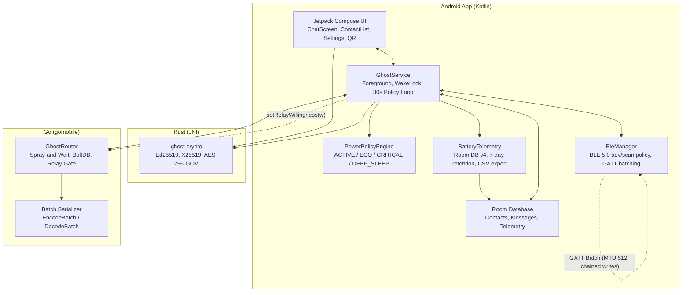
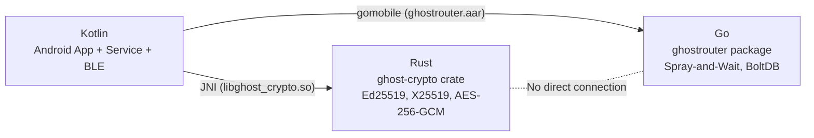
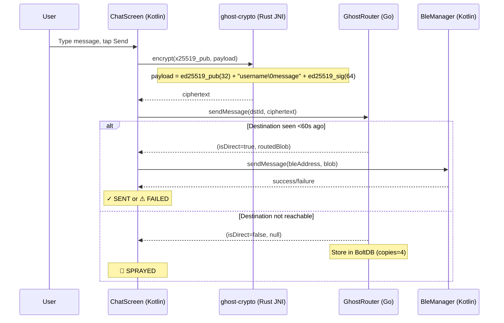
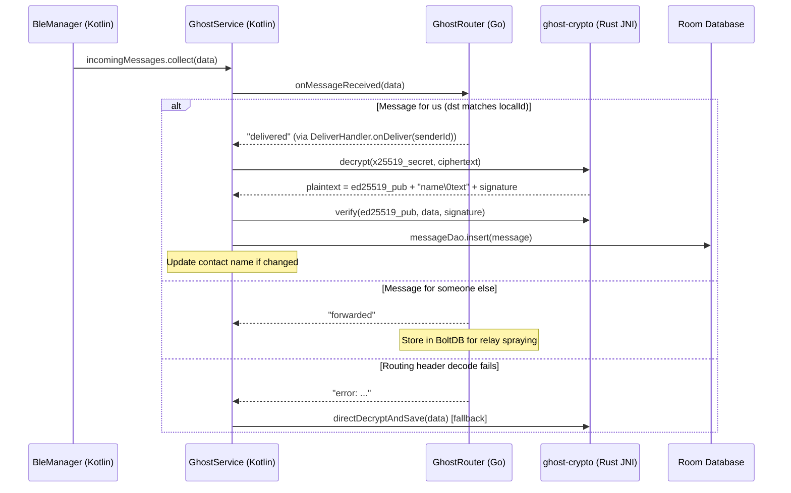
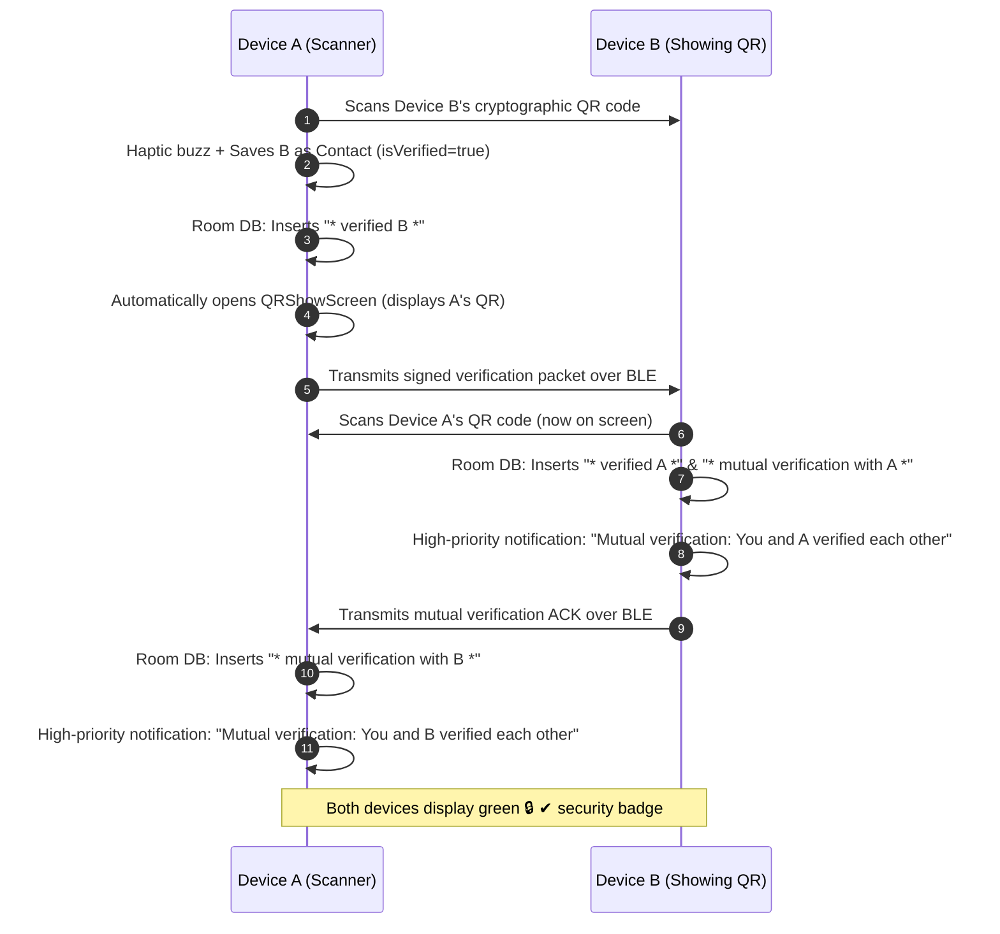

# GHOST Protocol System Architecture

> **Version:** v0.2.0 — includes PowerPolicyEngine, BatteryTelemetry, and GATT message batching.
> For the full 7-layer vision, see `docs/rfc/rfc-001-physics.md` through `rfc-007-application.md`.

## 1. Overview

GHOST Protocol v0.2.0 is an offline mesh messenger for Android. Two phones discover each other over BLE 5.0, exchange Ed25519/X25519 keys via QR code, and send end-to-end encrypted text messages routed through a Go Spray-and-Wait router. Messages can hop through intermediate phones when sender and receiver are not in direct BLE range. 

v0.2.0 introduces a centralized **PowerPolicyEngine** (4 dynamic modes: ACTIVE, ECO, CRITICAL, DEEP_SLEEP), **Message Batching** over single GATT sessions with sequential write-chaining, **Relay Willingness Gating** to shed relay burdens on dying batteries, and **BatteryTelemetry** with SQLite snapshot logging and CSV export.

**Languages:** Kotlin (UI + BLE + Power + glue layer), Rust (crypto via JNI), Go (routing + batch serializer via gomobile)

## 2. Implemented Architecture

## 3. FFI Boundaries

## 4. Message Send Flow (v0.1.5)

## 5. Message Receive Flow

## 6. Component Summary

| Component | Language | Size | Purpose |
|---|---|---|---|
| `android/app/` | Kotlin | ~5,600 LOC | UI (Compose), BLE (GATT + batching), PowerPolicyEngine, BatteryTelemetry, Room DB (v6), Mutual QR |
| `rust/ghost-crypto/` | Rust | ~300 LOC | Ed25519 sign/verify, X25519 DH, AES-256-GCM encrypt/decrypt |
| `go/ghostrouter/` | Go | ~950 LOC | Spray-and-Wait routing, batch serializer, relay willingness gating, BoltDB store |

## 7. Key Data Structures

| Structure | Format | Notes |
|---|---|---|
| Identity blob | `ed25519_seed(32) + ed25519_pub(32) + x25519_secret(32) + x25519_pub(32)` = 128 bytes | Generated once at first launch |
| QR payload | `GHOST:<Base64(ed25519_pub + x25519_pub + name_utf8)>` | In-person zero-TOFU exchange |
| Contact ID | `SHA-256(ed25519_pub).take(8).toHex()` → 16-char hex string | Stable unique identifier |
| BLE fingerprint | `SHA-256(ed25519_pub).take(4)` → 4 bytes in primary `advData` | Enables passive scanning & survives MAC rotation |
| Router peer ID | `SHA-256(ed25519_pub)` → 32 raw bytes | Used by Go router in BoltDB |
| Message ID | `computeMessageID(payload + random_nonce)` | Prevents collisions & replay |
| Encrypted payload | `[ed25519_pub(32)] [name\0body OR name\0REPLY\0qSender\0qText\0body] [ed25519_sig(64)]` | Encrypted with X25519 + AES-256-GCM |
| Single wire format | `[4B headerLen][JSON RoutingHeader][encrypted payload]` | Backward-compatible direct & routed envelope |
| Batch wire format | `[1B count][4B len1][msg1][4B len2][msg2]...` | Single GATT connection sequential writes |
| Telemetry record | `TelemetryEntity` in Room (`telemetry_snapshots`): 15 metrics | 48-hour rolling retention with CSV export |

## 8. Reciprocal QR Verification Flow

## 9. Deployment Model
- Single debug APK (~46 MB, includes arm64-v8a + x86_64 native libraries)
- **Zero Google Play Services** dependencies (pure AOSP compatible)
- Sideloadable via USB, local ad-hoc transfer, or microSD
- Target: Android 8.0+ (API 26), 1GB RAM minimum, zero internet connectivity required
