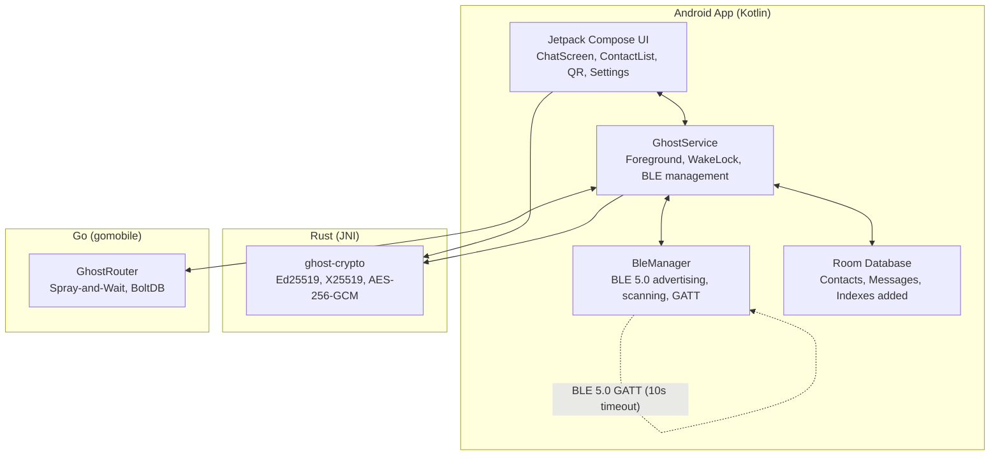
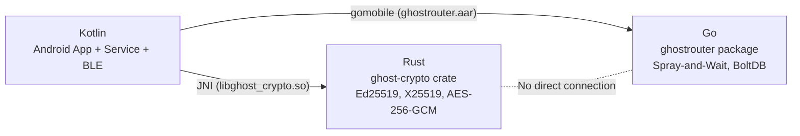
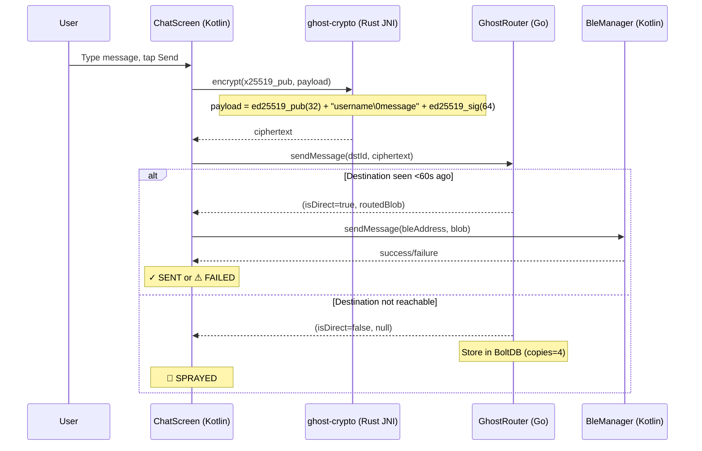
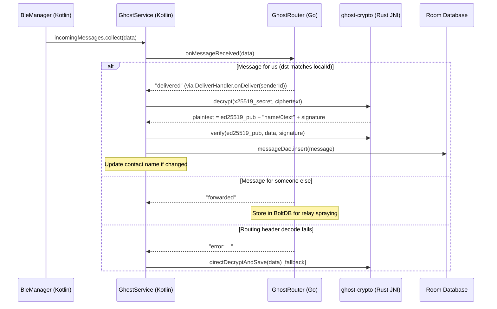

# GHOST Protocol System Architecture

> **Version:** v0.1.5 — hardened after 10 audit rounds (67 bugs fixed).
> For the full 7-layer vision, see `docs/rfc/rfc-001-physics.md` through `rfc-007-application.md`.

## 1. Overview

GHOST Protocol v0.1.5 is a 3-component offline mesh messenger for Android. Two phones discover each other over BLE 5.0, exchange Ed25519/X25519 keys via QR code, and send end-to-end encrypted text messages routed through a Go Spray-and-Wait router. Messages can hop through intermediate phones when sender and receiver are not in direct BLE range. No servers, no internet, no accounts.

**Languages:** Kotlin (UI + BLE + glue layer), Rust (crypto via JNI), Go (routing via gomobile)

## 2. Implemented Architecture

## 3. FFI Boundaries

## 4. Message Send Flow (v0.1.5)

## 5. Message Receive Flow

## 6. Component Summary

| Component | Language | Size | Purpose |
|---|---|---|---|
| `android/app/` | Kotlin | ~4,000 LOC | UI (Compose), BLE (GATT), Room DB, Service |
| `rust/ghost-crypto/` | Rust | ~300 LOC | Ed25519 sign/verify, X25519 DH, AES-256-GCM encrypt/decrypt |
| `go/ghostrouter/` | Go | ~800 LOC | Spray-and-Wait routing, BoltDB persistence, wire format |

## 7. Key Data Structures

| Structure | Format |
|---|---|
| Identity blob | `ed25519_seed(32) + ed25519_pub(32) + x25519_secret(32) + x25519_pub(32)` = 128 bytes |
| QR payload | `GHOST:<Base64(ed25519_pub + x25519_pub + name_utf8)>` |
| Contact ID | `SHA-256(ed25519_pub).take(8).toHex()` → 16-char hex string |
| BLE fingerprint | `SHA-256(ed25519_pub).take(4)` → 4 bytes in scan response |
| Router peer ID | `SHA-256(ed25519_pub)` → 32 raw bytes |
| Message ID | `computeMessageID(payload + random_nonce)` → collision-resistant |
| Encrypted payload | `[ed25519_pub(32)] [username\0message] [ed25519_sig(64)]` → encrypted with X25519+AES-256-GCM |
| Routing wire format | `[4B headerLen][JSON RoutingHeader][encrypted payload]` |

## 8. Deployment Model
- Single debug APK (~46 MB, includes arm64 + x86_64 native libs)
- **No Google Play Services** dependencies
- Can be sideloaded via USB, file share, or direct APK transfer
- Target: Android 8.0+ (API 26), 1GB RAM, no internet required
