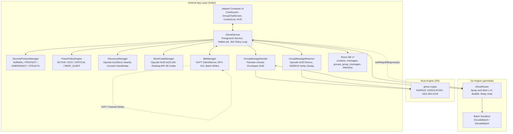
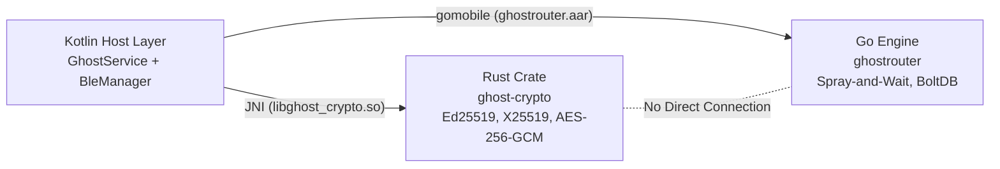
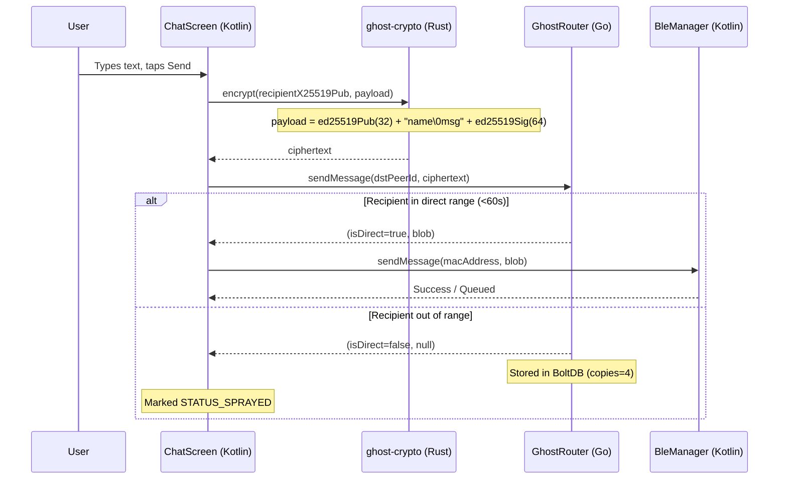
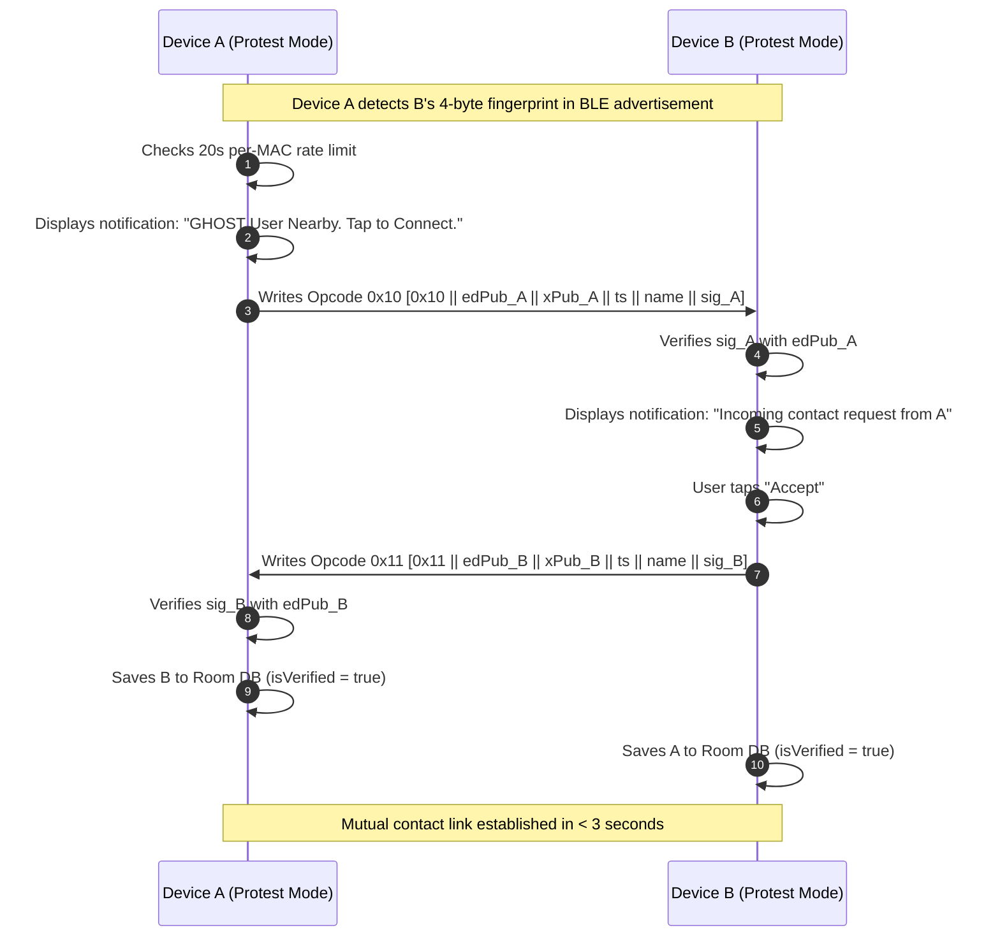
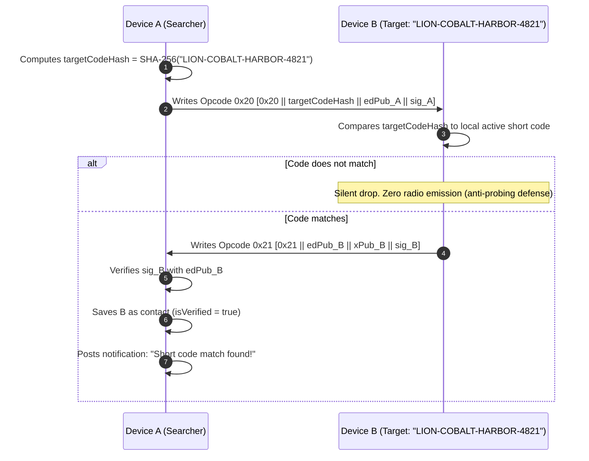
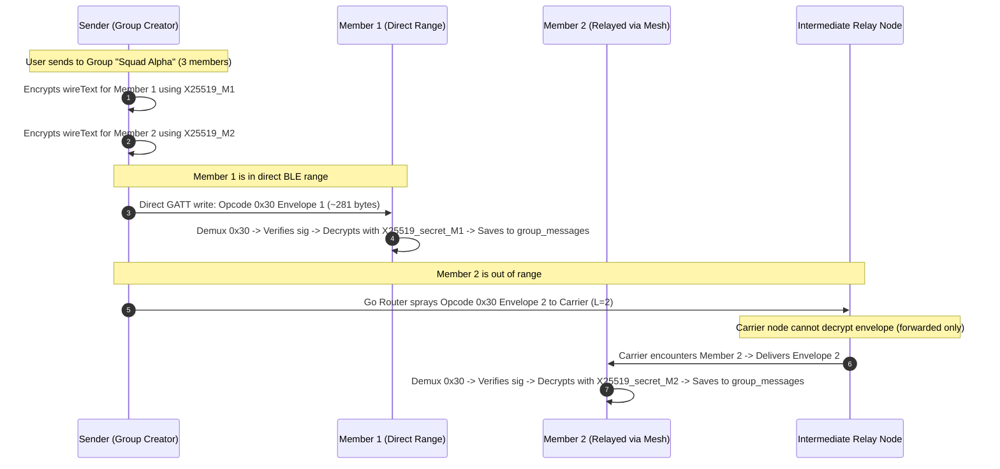
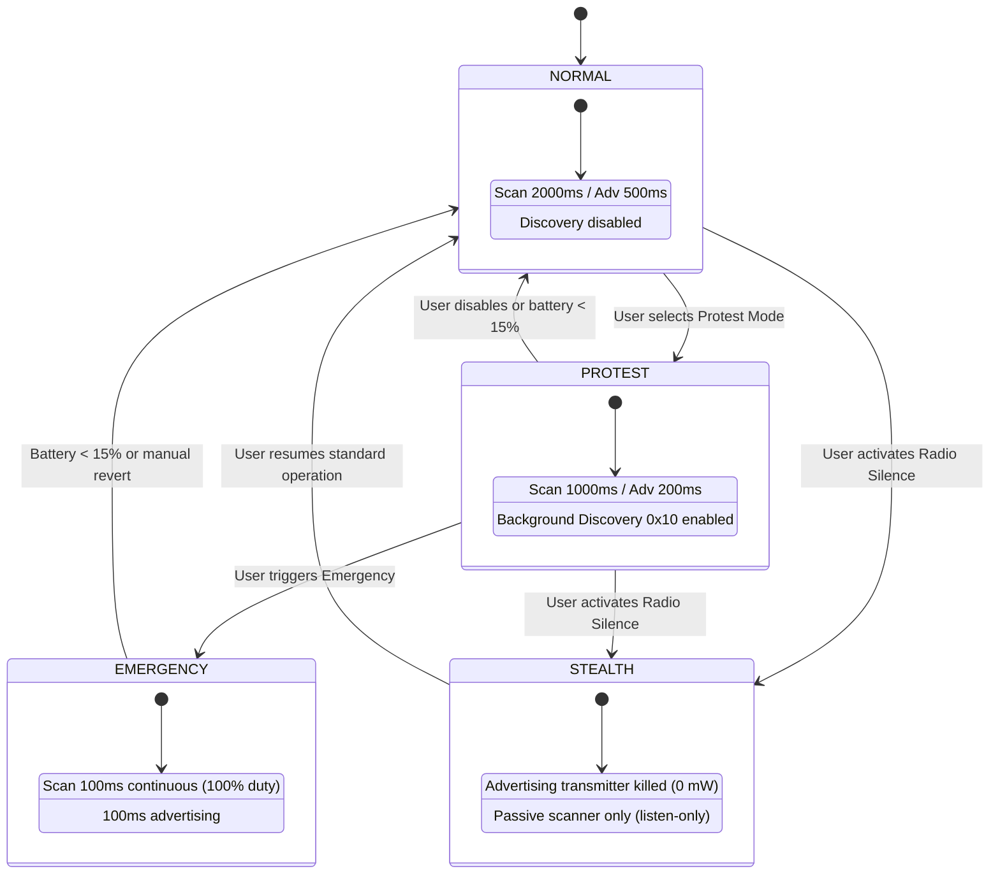

# GHOST Protocol System Architecture

> **Version:** v0.3.5 — includes Security Posture Engine, Nearby Discovery (0x10/0x11), 24h Rotating BIP-39 Codes (0x20–0x23), Cell Groups (0x30), and Room Schema v7.  
> **Target Platform:** Android 8.0+ (API 26+), pure AOSP, zero Google Play Services.

---

## 1. System Overview

GHOST is an offline mesh communications system for Android devices. Devices communicate over Bluetooth Low Energy (BLE) 5.0. Cryptography is handled by a native Rust crate (`ghost-crypto`) over JNI. Multi-hop delay-tolerant mesh routing is handled by a native Go engine (`ghostrouter`) running BoltDB over gomobile.

Higher-level application orchestration — security postures, one-tap discovery, ephemeral code rotation, group messaging, and battery-aware duty cycles — is handled in Kotlin.



---

## 2. FFI & Process Boundaries

Kotlin serves as the system coordinator. Rust and Go share zero address space and do not talk directly; all data passes through Kotlin as raw byte arrays:



### JNI Invariant
JNI buffers must be treated as transient. Data pointers passed into Go from Kotlin via gomobile can be freed immediately after the call returns. The Go router copies incoming byte slices via `make([]byte, len(src))` before persisting into BoltDB.

---

## 3. Wire Protocol Demuxing (Byte 0)

Incoming GATT write requests land in `BleManager.onCharacteristicWriteRequest`. Packets are demuxed by inspecting `data[0]`:

```
Byte 0 Value   Handler                    Routing Path
-----------------------------------------------------------------
0x10           DiscoveryManager           Kotlin-to-Kotlin direct
0x11           DiscoveryManager           Kotlin-to-Kotlin direct
0x20           ShortCodeManager           Kotlin-to-Kotlin direct
0x21           ShortCodeManager           Kotlin-to-Kotlin direct
0x22           GhostRouter (multi-hop)    Go Spray-and-Wait mesh
0x23           GhostRouter (multi-hop)    Go Spray-and-Wait mesh
0x30           GroupMessageReceiver       Kotlin unicast envelope
All other      GhostRouter (0x01)         Go Spray-and-Wait mesh
```

---

## 4. Message Flow Diagrams

### 4.1 1:1 Direct / Multi-Hop Message Send Flow



### 4.2 One-Tap Nearby Discovery Handshake (Opcodes 0x10 / 0x11)



### 4.3 24-Hour Rotating BIP-39 Short Code Resolution (Opcodes 0x20 / 0x21)



### 4.4 Cell Group Fan-Out & Delivery (Opcode 0x30)



---

## 5. Security Posture State Machine



---

## 6. Persistence Schema (Room Database v7)

```
+---------------------------------------------------------------------------------+
|                                 GHOST DATABASE (v7)                             |
+---------------------------------------------------------------------------------+

contacts
├── id: TEXT PRIMARY KEY (16-char hex)
├── name: TEXT
├── ed25519PubKey: TEXT (Base64)
├── x25519PubKey: TEXT (Base64)
├── bleAddress: TEXT (nullable)
├── isVerified: INTEGER (0 or 1)
└── createdAt: INTEGER

messages
├── id: TEXT PRIMARY KEY (UUID)
├── contactId: TEXT (FK)
├── content: TEXT
├── isOutgoing: INTEGER
├── timestamp: INTEGER
├── isVerified: INTEGER
├── status: INTEGER (0=PEND, 1=SENT, 2=DELIV, 3=FAIL, 4=SPRAY)
├── replyToSender: TEXT (nullable)
└── replyToText: TEXT (nullable)

groups
├── groupId: TEXT PRIMARY KEY (64-char hex)
├── name: TEXT
├── creatorContactId: TEXT (16-char hex)
├── memberContactIdsJson: TEXT (JSON array string)
├── createdAt: INTEGER
└── isActive: INTEGER (0 or 1)

group_messages
├── id: INTEGER PRIMARY KEY AUTOINCREMENT
├── groupId: TEXT
├── senderContactId: TEXT
├── text: TEXT
├── timestamp: INTEGER
├── status: INTEGER (0=PEND, 1=SENT, 2=DELIV, 3=FAIL, 4=SPRAY)
├── replyToSender: TEXT (nullable)
└── replyToText: TEXT (nullable)

telemetry_snapshots
├── id: INTEGER PRIMARY KEY AUTOINCREMENT
├── timestamp: INTEGER
├── batteryPercent: INTEGER
├── batteryTemperature: REAL
├── isCharging: INTEGER
├── bleScanTimeMs: INTEGER
├── bleAdvertiseTimeMs: INTEGER
├── gattConnections: INTEGER
├── gattBytesTx: INTEGER
├── gattBytesRx: INTEGER
├── cpuWakeups: INTEGER
├── messagesForwarded: INTEGER
├── messagesDelivered: INTEGER
├── avgDeliveryLatencyMs: INTEGER
├── currentMode: TEXT
└── peerCount: INTEGER
```
