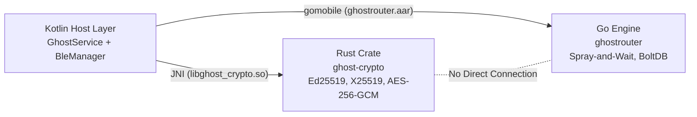
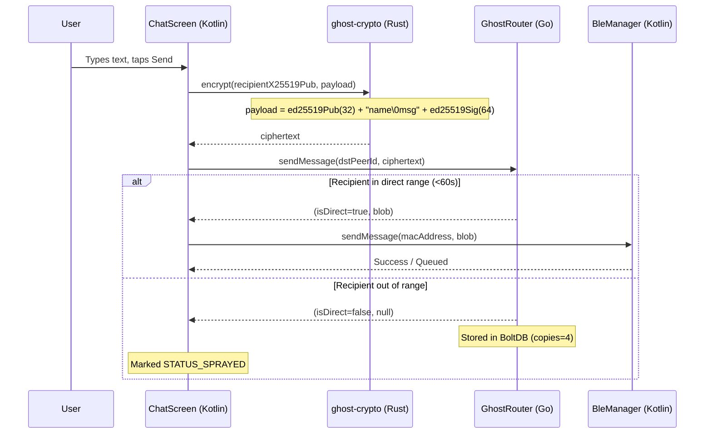
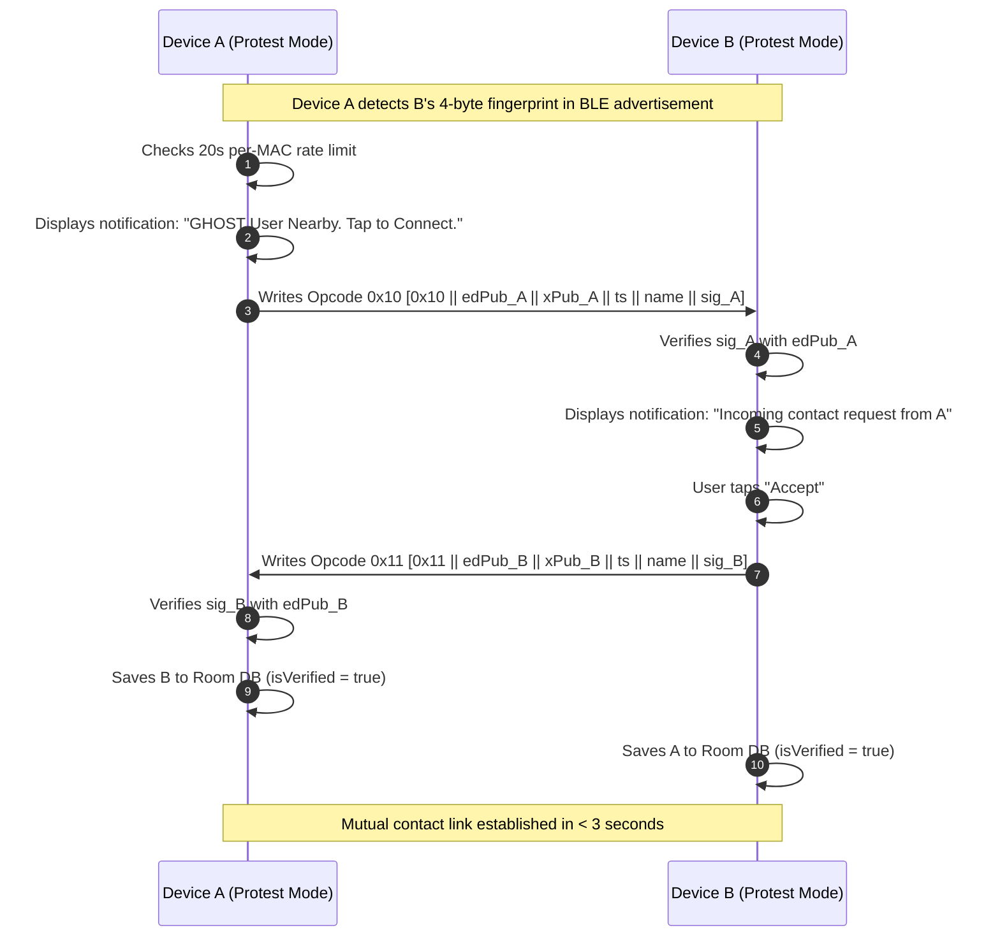
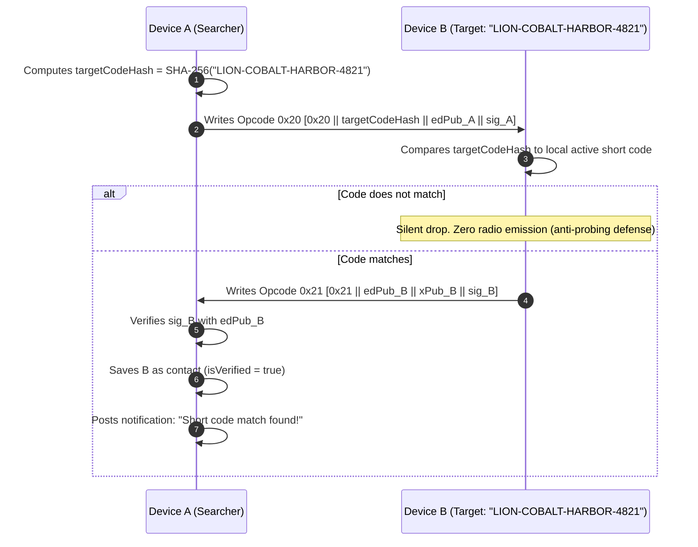
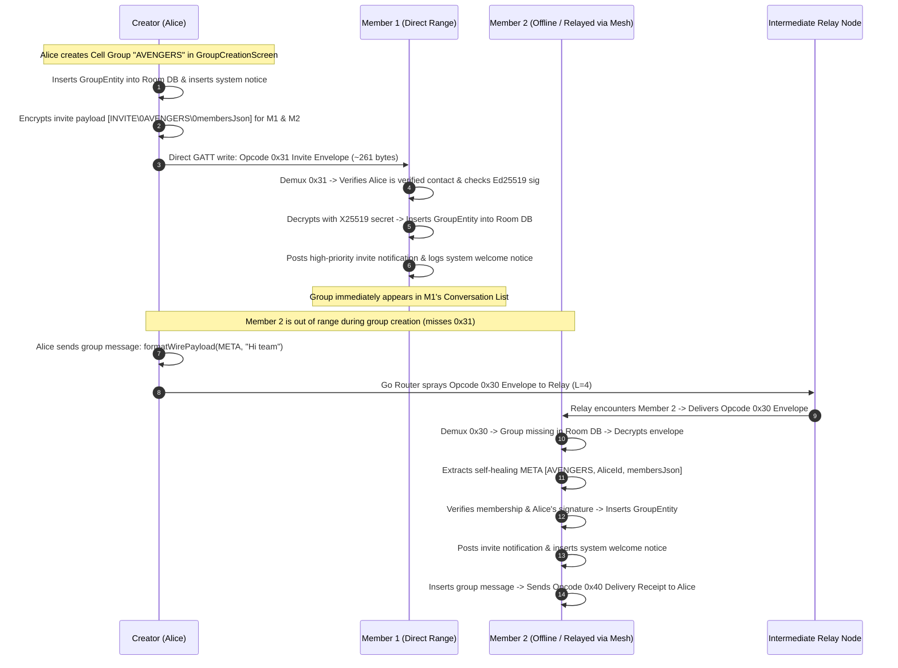
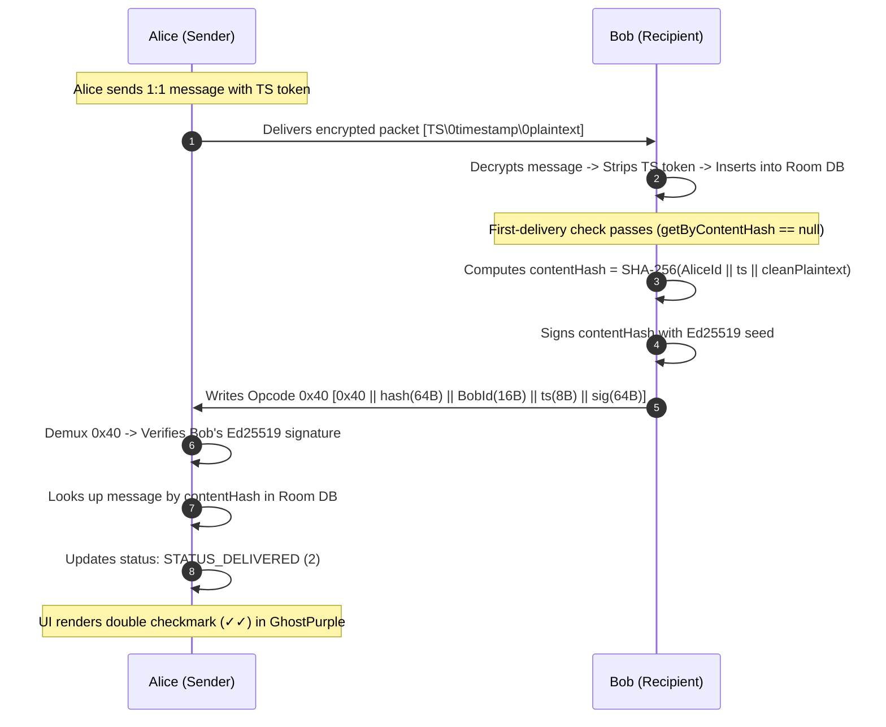
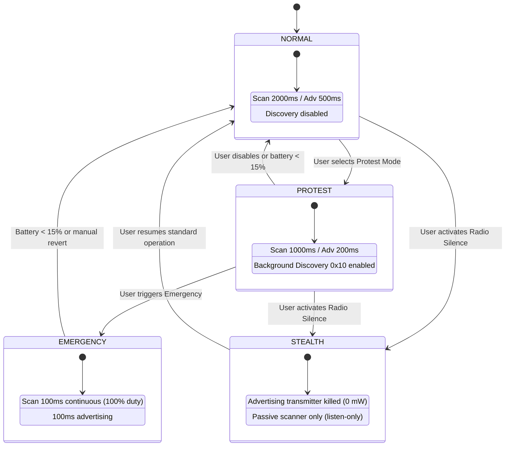
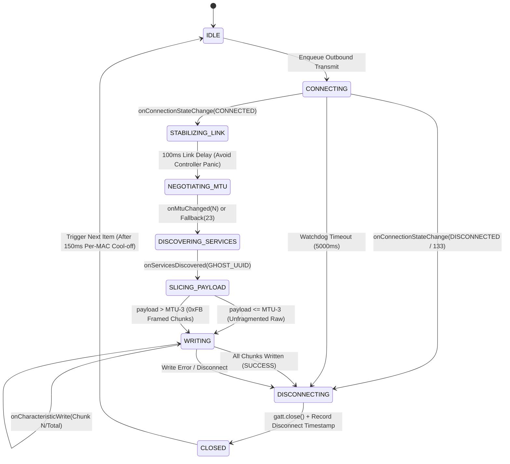
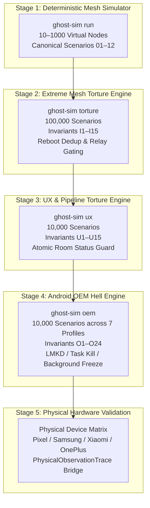

# GHOST Protocol System Architecture

> **Author:** PEDDI SANKARA RAO
> **Version:** v0.4.3 — includes Security Posture Engine, Nearby Discovery (0x10/0x11), 24h Rotating BIP-39 Codes (0x20–0x23), Cell Groups (0x30/0x31), Delivery Receipts (0x40), Contact Introductions (0x50), Serialized GATT Queue, Atomic Status Guard, Room Schema v9, and 4-Stage Adversarial Verification Architecture.
> **Target Platform:** Android 8.0+ (API 26+), pure AOSP, zero Google Play Services.

---

## 1. System Overview

GHOST is an offline mesh communications system for Android devices. Devices communicate over Bluetooth Low Energy (BLE) 5.0. Cryptography is handled by a native Rust crate (`ghost-crypto`) over JNI with `catch_unwind` panic boundaries. Multi-hop delay-tolerant mesh routing is handled by an embedded Go engine (`ghostrouter`) running BoltDB and persistent SQLite deduplication over gomobile.

Higher-level application orchestration — security postures, one-tap discovery, ephemeral code rotation, group messaging, delivery receipts, contact vouching, serialized GATT operations, atomic status immutability, and battery-aware duty cycles — is handled in Kotlin.

```mermaid
graph TD
    subgraph "Android App Layer (Kotlin)"
        UI[Jetpack Compose UI<br>ChatScreen, GroupChatScreen, ContactList, IntroSheet, HUD]
        VM[ChatViewModel<br>Sub-1ms Optimistic Bubble ACK]
        Repo[ConversationRepository<br>Off-Thread Joins & O(1) Peer Match]
        Service[GhostService<br>Foreground Service, WakeLock, 30s Policy Loop]
        Posture[SecurityPostureManager<br>NORMAL / PROTEST / EMERGENCY / STEALTH]
        Power[PowerPolicyEngine<br>ACTIVE / ECO / CRITICAL / DEEP_SLEEP]
        Discovery[DiscoveryManager<br>Opcode 0x10/0x11 Nearby Consent Handshake]
        ShortCode[ShortCodeManager<br>Opcode 0x20-0x23 24h Rotating BIP-39 Codes]
        GroupSend[GroupMessageSender<br>Pairwise Unicast Envelopes 0x30/0x31]
        GroupRecv[GroupMessageReceiver<br>Opcode 0x30 Demux, Ed25519 Verify, Dedup]
        Receipt[DeliveryReceiptHandler<br>Opcode 0x40 E2E Double Check ✓✓]
        Intro[IntroductionHandler<br>Opcode 0x50 One-Way Trust Vouching]
        GattQueue[GattOperationQueue<br>Serialized FIFO, 150ms Cool-off, Watchdog]
        BLE[BleManager<br>GATT Client/Server, MTU 512, Dual API 33+ Write]
        Room[Room DB v9<br>Atomic Status Guard AND status!=2 OR :status=2]
    end

    subgraph "Rust Engine (JNI)"
        Crypto[ghost-crypto<br>Ed25519, X25519 ECDH, AES-256-GCM<br>catch_unwind Panic Safety]
    end

    subgraph "Go Engine (gomobile)"
        Router[GhostRouter<br>Spray-and-Wait L=4, BoltDB, Relay Gate]
        Dedup[Persistent Dedup<br>SQLite Reboot Invariance]
        Batch[Batch Serializer<br>EncodeBatch / DecodeBatch]
    end

    UI <--> VM
    VM <--> Repo
    Repo <--> Room
    VM --> Service
    Service --> Posture
    Service --> Power
    Service --> Discovery
    Service --> ShortCode
    Service --> GroupSend
    Service --> GroupRecv
    Service --> Receipt
    Service --> Intro
    Service <--> BLE
    BLE <--> GattQueue
    Service <--> Room
    GroupSend --> Crypto
    GroupRecv --> Crypto
    Receipt --> Crypto
    Intro --> Crypto
    GroupSend <--> Router
    Service <--> Router
    Router <--> Dedup
    Router --> Batch
    Service -.->|"setRelayWillingness(w)"| Router
    GattQueue -.->|"Serialized Outbound Transmit"| BLE
```

---

## 2. FFI & Process Boundaries

Kotlin serves as the system coordinator. Rust and Go share zero address space and do not talk directly; all data passes through Kotlin as raw byte arrays:



### JNI Invariant
JNI buffers must be treated as transient. Data pointers passed into Go from Kotlin via gomobile can be freed immediately after the call returns. The Go router copies incoming byte slices via `make([]byte, len(src))` before persisting into BoltDB.

---

## 3. Wire Protocol Demuxing (Byte 0)

Incoming GATT write requests land in `BleManager.onCharacteristicWriteRequest`. Packets are demuxed by inspecting `data[0]`:

```
Byte 0 Value   Handler                    Routing Path
-----------------------------------------------------------------
0x10           DiscoveryManager           Kotlin-to-Kotlin direct
0x11           DiscoveryManager           Kotlin-to-Kotlin direct
0x20           ShortCodeManager           Kotlin-to-Kotlin direct
0x21           ShortCodeManager           Kotlin-to-Kotlin direct
0x22           GhostRouter (multi-hop)    Go Spray-and-Wait mesh
0x23           GhostRouter (multi-hop)    Go Spray-and-Wait mesh
0x30           GroupMessageReceiver       Kotlin unicast envelope
0x40           DeliveryReceiptHandler     Kotlin E2E delivery ack
0x50           IntroductionHandler        Kotlin vouching envelope
0xFB           BleManager (Link Reassembly) Link-layer GATT reassembly
All other      GhostRouter (0x01)         Go Spray-and-Wait mesh
```

---

## 4. Message Flow Diagrams

### 4.1 1:1 Direct / Multi-Hop Message Send Flow



### 4.2 One-Tap Nearby Discovery Handshake (Opcodes 0x10 / 0x11)



### 4.3 24-Hour Rotating BIP-39 Short Code Resolution (Opcodes 0x20 / 0x21)



### 4.4 Cell Group Creation, Invite (Opcode 0x31) & Self-Healing Delivery (Opcode 0x30)



### 4.5 End-to-End Cryptographic Delivery Receipt (Opcode 0x40)



### 4.6 Cryptographic Contact Introduction (Opcode 0x50)

```mermaid
sequenceDiagram
    autonumber
    participant A as Alice (Mutual Friend / Voucher)
    participant B as Bob (Target Peer)
    participant C as Carol (Recipient)

    Note over A: Alice opens Bob's verified profile -> "Introduce to..." -> Selects Carol
    A->>A: Signs Bob's keys: Ed25519(0x50 || BobKeys || BobName || CarolId || AliceId)
    A->>A: Packages Opcode 0x50 payload (147 + N bytes)
    A->>A: Encrypts to Carol's X25519 key -> Transmits via 1:1 mesh envelope
    C->>C: Decrypts outer envelope -> Demuxes Opcode 0x50
    C->>C: Verifies Alice is verified contact -> Verifies Alice's signature
    C->>C: Caches in memory (10m expiry) -> Displays notification
    C->>C: Carol taps review -> Displays IntroductionReviewBottomSheet
    Note over C: Shows Alice (Ghost Aura) + Bob (Slate avatar + INTRODUCED chip)
    C->>C: Carol taps "Add Contact"
    C->>C: Inserts Bob: isIntroduced = true, isVerified = false
    Note over C: Chat screen displays persistent one-way trust banner
    Note over B: Bob is NOT notified; receives zero keys from Carol
```

---

## 5. Security Posture State Machine



---

## 6. Persistence Schema (Room Database v9)

```
+---------------------------------------------------------------------------------+
|                                 GHOST DATABASE (v9)                             |
+---------------------------------------------------------------------------------+

contacts
├── id: TEXT PRIMARY KEY (16-char hex)
├── name: TEXT
├── ed25519PubKey: TEXT (Base64)
├── x25519PubKey: TEXT (Base64)
├── bleAddress: TEXT (nullable)
├── isVerified: INTEGER (0 or 1)
├── isIntroduced: INTEGER (0 or 1, added in v9)
└── createdAt: INTEGER

messages
├── id: TEXT PRIMARY KEY (UUID)
├── contactId: TEXT (FK)
├── content: TEXT
├── isOutgoing: INTEGER
├── timestamp: INTEGER
├── isVerified: INTEGER
├── status: INTEGER (0=PEND, 1=SENT, 2=DELIV, 3=FAIL, 4=SPRAY)
├── replyToSender: TEXT (nullable)
├── replyToText: TEXT (nullable)
└── contentHash: TEXT (nullable, indexed, added in v8)

groups
├── groupId: TEXT PRIMARY KEY (64-char hex)
├── name: TEXT
├── creatorContactId: TEXT (16-char hex)
├── memberContactIdsJson: TEXT (JSON array string)
├── createdAt: INTEGER
└── isActive: INTEGER (0 or 1)

group_messages
├── id: INTEGER PRIMARY KEY AUTOINCREMENT
├── groupId: TEXT
├── senderContactId: TEXT
├── text: TEXT
├── timestamp: INTEGER
├── status: INTEGER (0=PEND, 1=SENT, 2=DELIV, 3=FAIL, 4=SPRAY)
├── replyToSender: TEXT (nullable)
├── replyToText: TEXT (nullable)
├── contentHash: TEXT (nullable, indexed, added in v8)
└── deliveredMemberIdsJson: TEXT (JSON array, added in v8)

telemetry_snapshots
├── id: INTEGER PRIMARY KEY AUTOINCREMENT
├── timestamp: INTEGER
├── batteryPercent: INTEGER
├── batteryTemperature: REAL
├── isCharging: INTEGER
├── bleScanTimeMs: INTEGER
├── bleAdvertiseTimeMs: INTEGER
├── gattConnections: INTEGER
├── gattBytesTx: INTEGER
├── gattBytesRx: INTEGER
├── cpuWakeups: INTEGER
├── messagesForwarded: INTEGER
├── messagesDelivered: INTEGER
├── avgDeliveryLatencyMs: INTEGER
├── currentMode: TEXT
└── peerCount: INTEGER
```

---

## 7. Compose UI & Data Flow Architecture (v0.3.8)

In v0.3.8, the UI layer was restructured to isolate state mutation, eliminate recomposition storms, and provide sub-millisecond perceived user acknowledgement:

```mermaid
graph TD
    subgraph "UI Composition Layer (Main Thread)"
        Screen[ChatScreen / ContactListScreen]
        FAB[GhostActionFab + NewChatBottomSheet]
        Bubble[Optimistic Message Bubble]
    end

    subgraph "State & Coordination Layer"
        VM[ChatViewModel<br>StateFlow&lt;List&lt;MessageUiModel&gt;&gt;]
        Repo[ConversationRepository<br>Flow&lt;List&lt;ConversationItem&gt;&gt;]
    end

    subgraph "Background Thread (Dispatchers.Default / IO)"
        JoinSort[Off-Thread Joins & Chronological Sorting]
        PeerIndex[O(1) Peer Fingerprint Index]
        AsyncPersist[Asynchronous Room Insert & Crypto Dispatch]
    end

    Screen -->|Tap Send| VM
    VM -->|Immediate Append| Bubble
    VM -->|Dispatch Job| AsyncPersist
    Repo -->|flowOn Dispatchers.Default| JoinSort
    JoinSort --> PeerIndex
    PeerIndex --> Repo
    Repo -->|StateFlow| Screen
    Screen --> FAB
```

### Invariants:
1. **Never Block on Persistence:** Tapping send immediately yields an in-memory `PENDING` bubble (<1ms perceived latency). Room insertion, X25519 key agreement, AES-256-GCM encryption, and GATT/Go routing execute asynchronously.
2. **Off-Thread Feed Joins:** `ConversationRepository` performs all contact-to-group merging, latest message mapping, and O(1) RF fingerprint matching off the main thread.
3. **Zero Main-Thread Cryptography in Lists:** No Base64 decoding or SHA-256 fingerprint generation occurs inside `LazyColumn` item renderers.
4. **Ergonomic Boundaries:** All interactive controls strictly enforce a 48dp minimum touch target (`GhostTheme.MinTouchTarget`).

---

## 8. Serialized GATT Operation Queue (`GattOperationQueue`)

To prevent multi-coroutine GATT controller overruns and chronic `GATT 133` disconnect loops on Android, all outbound client GATT operations flow through `GattOperationQueue`:



### Key Invariants:
- **Strict Single Connection ($O_4$):** At most 1 active client GATT connection across all peers simultaneously.
- **150ms MAC-Level Cool-off:** Any reconnect to a recently disconnected MAC address is delayed until 150ms has elapsed.
- **Closed GATT Safety ($O_5$):** Stale or duplicate asynchronous callbacks arriving after teardown are safely ignored.
- **100ms Link Stabilization Delay:** Budget chipsets (MediaTek/Unisoc) reject `requestMtu(512)` or drop the connection if MTU negotiation is invoked immediately in `onConnectionStateChange`. Delaying 100ms stabilizes the L2CAP physical channel before issuing the request.
- **Dynamic MTU Slicing & Transport Framing (`0xFB`):** If MTU negotiation fails or defaults to 23 bytes (leaving 20 usable ATT bytes), payloads exceeding `negotiatedMtu - 3` are sliced into 7-byte framed fragments:
  `[0xFB][2B transferId][2B fragIndex][2B totalFrags][data...]`
  Payloads within `negotiatedMtu - 3` bypass framing entirely for 100% wire backward compatibility.
- **Bounded Reassembly State Machine:** Inbound `0xFB` fragments are reassembled in memory (`BleManager.kt`). Sessions are bounded to 16 concurrent peers, expire after 30 seconds of inactivity, and enforce a 64 KB total size ceiling. Out-of-order and duplicate fragments are handled idempotently. Nested `0xFB` fragments are dropped.
- **Scan Burst Decoupling:** BLE scan callbacks firing every 100–300ms previously cancelled in-flight group message retransmissions under `Flow.collectLatest`. Group retransmissions now run in independent child coroutine jobs using `Flow.collect`, debounced at 10 seconds per group.
- **Reciprocal QR Verification Queue:** When a peer QR code is scanned before their BLE advertisement has been observed by the local scanner, the outbound verification handshake is queued in memory and dispatched immediately upon peer discovery.

---

## 9. 4-Stage Simulation Verification Architecture

GHOST Protocol validation is organized as a multi-tier pipeline:


