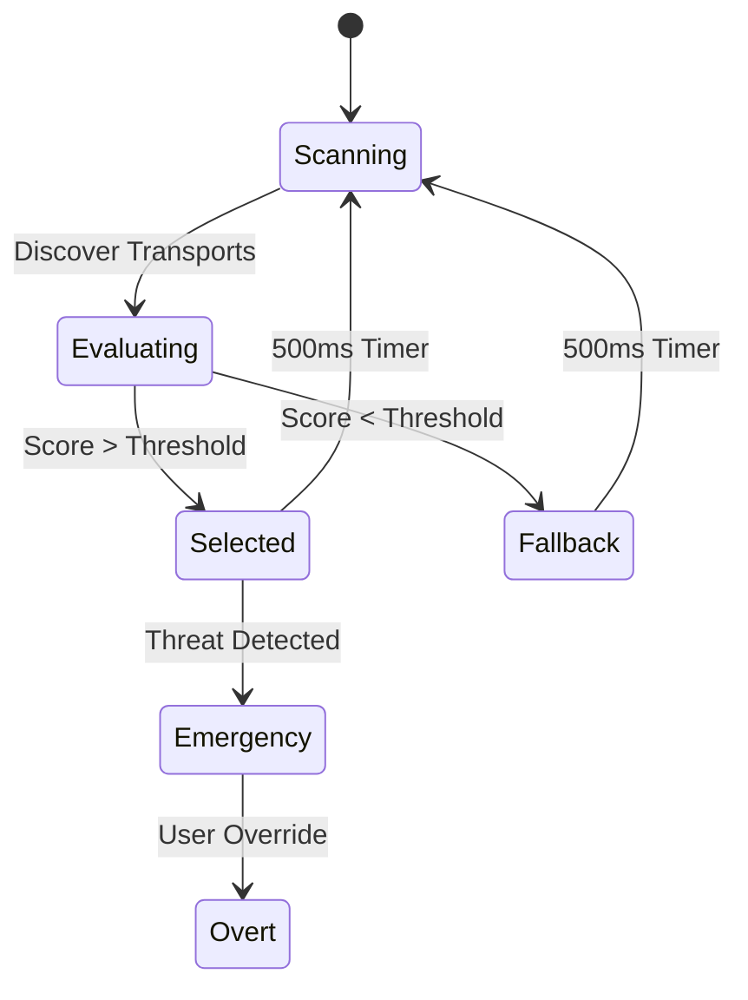
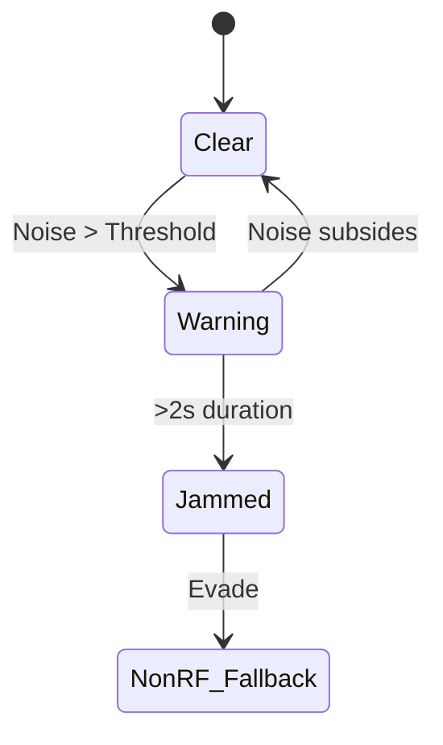

# GHOST Physics Layer RFC (Layer 1)
**Author:** PEDDI SANKARA RAO
**Rust crate:** `ghost-physics`

## 1. Purpose
The Physics Layer provides an omnimodal transport abstraction for the GHOST Protocol. Its primary purpose is to select the optimal communication channel every 500ms based on dynamic constraints including power consumption, stealth requirements, range, and available throughput.

## 2. Interface Specification
The layer abstracts multiple physical mediums through a unified `Transport` trait:

```rust
pub trait Transport {
    fn send(&self, packet: &[u8]) -> Result<()>;
    fn recv(&self, timeout: Duration) -> Result<Vec<u8>>;
    fn cost(&self) -> TransportCost; // mW, latency, range
    fn stealth_level(&self) -> StealthLevel;
}

pub struct ChannelSelector {
    pub fn select(&self, context: LinkContext) -> Vec<Box<dyn Transport>>;
}
```

## 3. Data Structures
```rust
pub struct TransportCost {
    pub power_mw: f32,
    pub latency_ms: u32,
    pub range_m: u32,
    pub throughput_bps: u32,
}

pub enum StealthLevel {
    Covert,
    Low,
    Medium,
    High,
    Overt,
}

pub struct LinkContext {
    pub threat_level: u8,
    pub battery_pct: u8,
    pub distance_estimate: Option<u32>,
    pub ambient_noise: f32,
}

pub struct TransportMetrics {
    pub packet_loss: f32,
    pub uptime: Duration,
    pub energy_consumed: f32,
}
```

## 4. Transport Implementations
The following physical transports are supported:

*   **BleCodedPhy:** Uses BLE 5.3 Coded PHY. Delivers 125kbps up to 1km range using S=8 coding. Power consumption is ~40mW.
*   **Ultrasonic:** 18-22kHz Chirp Spread Spectrum using standard device speakers and microphones. Achieves 200bps at 50m range. Power consumption is ~100mW.
*   **WifiDirect:** Standard WiFi P2P connection for high bandwidth. 10Mbps up to 50m. Power consumption is ~300mW.
*   **Infrasonic:** 1-20Hz vibration motor pulsing, detected by accelerometer. Extremely stealthy. 5bps over a 2km ground propagation radius. Power consumption is ~10mW.
*   **Infrared:** Uses 940nm LED and device camera. 10kbps up to 10m line-of-sight. Power consumption is ~50mW.

## 5. Channel Selection State Machine
The selection engine evaluates transports every 500ms using the formula:
`Weighted Score = (1/power) * stealth_weight * (throughput/required_throughput) * range_factor`



## 6. Threat Detection
Active jamming detection monitors the 2.4GHz noise floor via spectrum analysis.
If the noise floor exceeds the defined threshold for >2s, a transition to non-RF transports (Ultrasonic/Infrared) is triggered.



## 7. Power Budget Table
| Transport | Active TX (mW) | Active RX (mW) | Idle (mW) | Scan (mW) | Daily Budget (10m/day) |
| :--- | :--- | :--- | :--- | :--- | :--- |
| BleCodedPhy | 40 | 35 | 2 | 15 | ~400 mWh |
| Ultrasonic | 100 | 80 | 5 | 25 | ~1000 mWh |
| WifiDirect | 300 | 250 | 20 | 100 | ~3000 mWh |
| Infrasonic | 10 | 5 | 1 | 2 | ~100 mWh |
| Infrared | 50 | 45 | 1 | 10 | ~500 mWh |

## 8. Security Model
**Threats:**
*   **Jamming:** Handled via frequency hopping and non-RF fallback.
*   **Direction-Finding:** Handled by multi-transport redundancy (dispersing signals across modalities).
*   **Replay:** Handled by packet authentication and timestamping at Layer 3.

**Mitigations:** Fast channel switching, non-standard modulations, multi-path routing.

## 9. Performance Budget
*   **RAM:** 2MB maximum allocation.
*   **CPU:** 5% idle, up to 15% active during DSP (e.g., Ultrasonic FFT).
*   **Latency:** <50ms for RF (BLE), <200ms for acoustic/optical (Ultrasonic).
