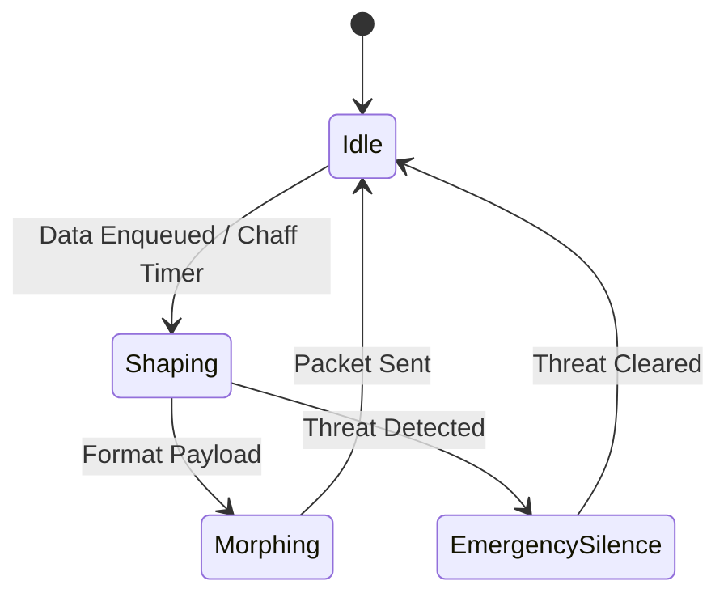

# GHOST Privacy Layer RFC (Layer 2)
**Rust crate:** `ghost-privacy`

## 1. Purpose
The Privacy Layer is responsible for oblivious traffic morphing and steganographic shaping. It ensures that GHOST Protocol traffic is cryptographically indistinguishable from legitimate, benign BLE beacons. All packets are padded to a fixed 512 bytes. To defeat traffic analysis, 70% of transmitted traffic is cover (dummy) traffic.

## 2. Interface Specification
```rust
pub trait PacketMorpher {
    fn morph(&self, raw_data: &[u8]) -> GhostPacket;
    fn demorph(&self, packet: &GhostPacket) -> Vec<u8>;
}

pub trait CoverTrafficGenerator {
    fn generate_chaff(&self) -> GhostPacket;
}

pub trait TrafficShaper {
    fn enqueue(&mut self, packet: GhostPacket);
    fn tick(&mut self) -> Option<GhostPacket>;
}
```

## 3. Data Structures
```rust
pub const PACKET_SIZE: usize = 512;
pub const DUMMY_RATIO: f32 = 0.7;

pub struct GhostPacket {
    pub header: PlausibleBeaconHeader, // 64 bytes, mimics Apple/Google beacon
    pub payload: [u8; 448], // encrypted + steganographically encoded
}

pub struct PlausibleBeaconHeader {
    pub beacon_type: BeaconType,
    pub uuid: [u8; 16],
    pub major: u16,
    pub minor: u16,
    pub tx_power: i8,
    pub padding: [u8; 39],
}

pub enum BeaconType {
    AirPods,
    Eddystone,
    MSBeacon,
    FindMy,
    SmartTag,
}

pub struct MorphingConfig {
    pub rotation_interval: Duration,
    pub allowed_types: Vec<BeaconType>,
}
```

## 4. Beacon Morphing Rules
Traffic must exactly mimic the format, timing, and advertising patterns of commercial BLE beacons. 
*   **AirPods:** Must include standard Apple continuity protocol headers and rotate MAC addresses synchronously.
*   **Eddystone:** Must mimic valid URL or UID frame formats.
*   **Rotation Schedule:** Morphing profile rotates every 15-45 minutes to prevent long-term fingerprinting.

## 5. Cover Traffic (Chaff) Generation
Chaff generation operates as a Poisson process with λ=0.5 packets/second. Chaff packets are cryptographically indistinguishable from real traffic from the outside. However, they decrypt into innocuous JSON content (e.g., weather updates, time syncs) to provide plausible deniability if the key is coerced.

## 6. Traffic Shaping Algorithm
The shaper ensures a constant-rate transmission regardless of actual data availability. 
*   Uses Poisson timing intervals to avoid rigidly rhythmic signatures.
*   Bursts of actual data are smoothed over time.
*   Features an adaptive rate: listens to local beacon density and blends into the existing noise floor without saturating the channel.

## 7. Steganographic Encoding
Payload bytes are dispersed steganographically. The 448-byte payload is woven into fields that ordinarily contain varying telemetry or diagnostic data in plausible beacons. 

## 8. Security Model
**Threat:** Traffic analysis, timing correlation, volume analysis, and machine-learning based fingerprinting.
**Defense:** Constant rate transmission, 70% dummy traffic injection, indistinguishability, and continuous signature morphing.

## 9. Performance Budget
*   **RAM:** 1MB.
*   **CPU:** 3% for traffic shaping and chaff generation.
*   **Bandwidth Overhead:** 3.3x overhead due to the 70% dummy ratio (for every 1 real packet, ~2.33 chaff packets are sent).

## 10. State Machine

