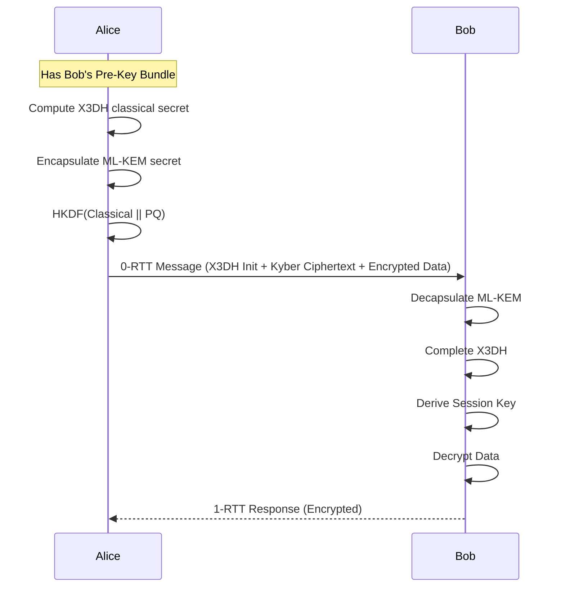
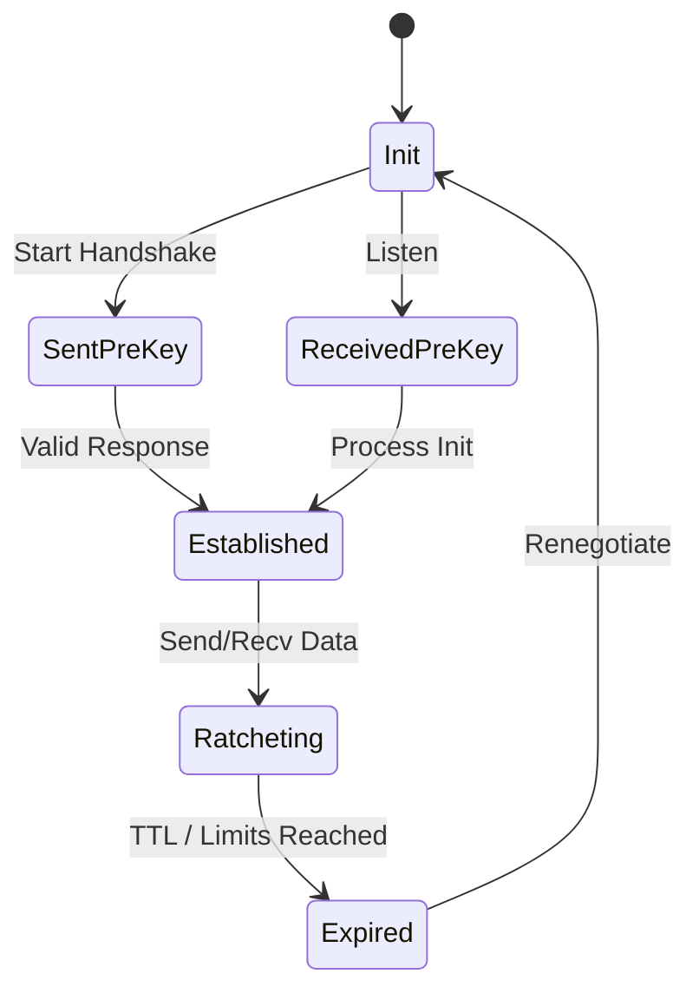

# GHOST Transport Layer RFC (Layer 3)
**Rust crate:** `ghost-transport`

## 1. Purpose
The Transport Layer establishes secure, encrypted sessions with 0-RTT capability, employing a hybrid classical and post-quantum cryptographic architecture.

## 2. Interface Specification
```rust
pub trait Session {
    fn encrypt(&mut self, plaintext: &[u8]) -> Result<EncryptedMessage>;
    fn decrypt(&mut self, ciphertext: &EncryptedMessage) -> Result<Vec<u8>>;
}

pub struct Handshake {
    // Handshake state machine and processing
}

pub trait KeyManager {
    fn fetch_pre_key(&self, peer_id: &PeerId) -> Option<GhostPreKey>;
    fn rotate_keys(&mut self, event: KeyRotationEvent);
}
```

## 3. Cryptographic Specification
*   **X3DH (Signal Protocol):** Used for classical ephemeral key agreement.
*   **ML-KEM-1024 (Kyber):** Used for post-quantum key encapsulation mechanism (KEM).
*   **ML-DSA-65 (Dilithium):** Used for post-quantum signatures and identity verification.
*   **Symmetric Encryption:** AES-256-GCM + XChaCha20-Poly1305 acting as double encryption for defense-in-depth.
*   **KDF:** HKDF-SHA3-256 for deriving session keys.
*   **Hybrid Construction:** The final key material is derived via HKDF on the concatenation: `classical_shared_secret || pq_shared_secret`.

## 4. Data Structures
```rust
pub struct GhostPreKey {
    pub identity_key: X25519PublicKey,
    pub ephemeral_keys: [X25519PublicKey; 100],
    pub kyber_key: MlKem1024PublicKey,
    pub dilithium_key: MlDsa65PublicKey,
    pub proof: ZKProofOfPossession,
}

pub struct GhostSession {
    pub session_id: [u8; 32],
    pub root_key: [u8; 32],
    pub tx_chain: [u8; 32],
    pub rx_chain: [u8; 32],
}

pub struct EncryptedMessage {
    pub header: [u8; 16],
    pub ciphertext: Vec<u8>,
    pub mac: [u8; 16],
}

pub enum HandshakeMessage {
    Init(GhostPreKey),
    Response(EncryptedMessage),
}

pub enum KeyRotationEvent {
    TimeElapsed,
    CompromiseSuspected,
    MessageLimitReached,
}
```

## 5. 0-RTT Encryption Flow


## 6. Pre-key Gossip Protocol
Pre-keys are distributed via the mesh DHT. To ensure rapid availability:
*   **Fanout:** 3 (Gossip to 3 peers).
*   **TTL:** 7 hops.
*   **Deduplication:** Hash-based check to prevent broadcast storms.
*   **Budget:** Pre-key bundles are compressed to fit within 4KB.

## 7. Key Rotation Schedule
*   **Ephemeral keys:** Rotated per-message via the double ratchet.
*   **Signed pre-keys:** Rotated every 24 hours.
*   **Identity keys:** Never rotated (used for account recovery only).
*   **Kyber keys:** Rotated every 7 days.

## 8. Double Ratchet Integration
The standard Signal double ratchet is augmented. The KDF chains receive entropy not just from Diffie-Hellman ephemeral ratchets, but optionally from fresh ML-KEM encapsulations if peer connectivity permits, refreshing the post-quantum forward secrecy.

## 9. Security Model
*   **Forward Secrecy:** Achieved via the per-message Double Ratchet.
*   **Post-Compromise Security:** Self-healing via continuous ephemeral key exchanges.
*   **Quantum Resistance:** ML-KEM protects against "Store Now, Decrypt Later" quantum attacks.

## 10. Performance Budget
*   **Handshake latency:** <200ms on an ARM Cortex-M4 equivalent.
*   **Key Generation:** <500ms.
*   **Per-message encrypt:** <1ms.
*   **RAM:** 3MB allocated for session states and key storage.
*   **Kyber operations:** ~5ms per encapsulation/decapsulation.

## 11. State Machine

