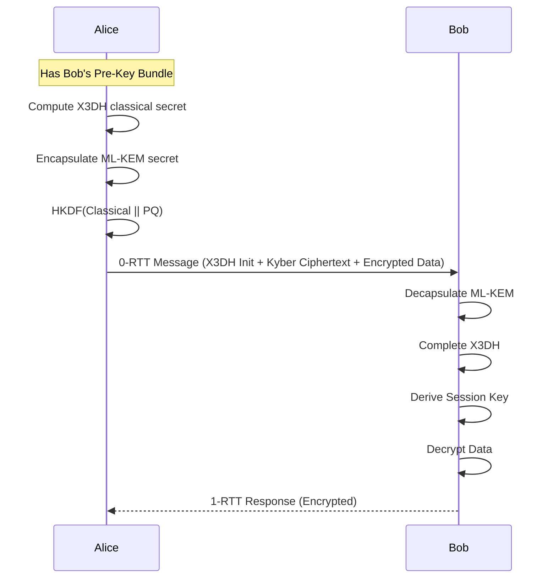
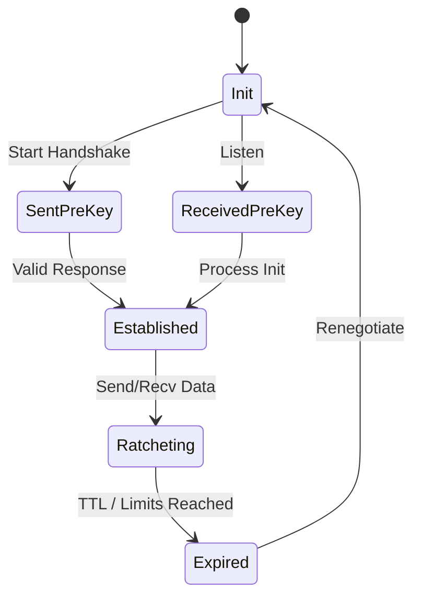

# GHOST Transport Layer RFC (Layer 3)
**Author:** PEDDI SANKARA RAO
**Rust crate:** `ghost-transport`

## 1. Purpose
The Transport Layer establishes secure, encrypted sessions with 0-RTT capability, employing a hybrid classical and post-quantum cryptographic architecture.

## 2. Interface Specification
```rust
pub trait Session {
    fn encrypt(&mut self, plaintext: &[u8]) -> Result<EncryptedMessage>;
    fn decrypt(&mut self, ciphertext: &EncryptedMessage) -> Result<Vec<u8>>;
}

pub struct Handshake {
    // Handshake state machine and processing
}

pub trait KeyManager {
    fn fetch_pre_key(&self, peer_id: &PeerId) -> Option<GhostPreKey>;
    fn rotate_keys(&mut self, event: KeyRotationEvent);
}
```

## 3. Cryptographic Specification
*   **X3DH (Signal Protocol):** Used for classical ephemeral key agreement.
*   **ML-KEM-1024 (Kyber):** Used for post-quantum key encapsulation mechanism (KEM).
*   **ML-DSA-65 (Dilithium):** Used for post-quantum signatures and identity verification.
*   **Symmetric Encryption:** AES-256-GCM + XChaCha20-Poly1305 acting as double encryption for defense-in-depth.
*   **KDF:** HKDF-SHA3-256 for deriving session keys.
*   **Hybrid Construction:** The final key material is derived via HKDF on the concatenation: `classical_shared_secret || pq_shared_secret`.

## 4. Data Structures
```rust
pub struct GhostPreKey {
    pub identity_key: X25519PublicKey,
    pub ephemeral_keys: [X25519PublicKey; 100],
    pub kyber_key: MlKem1024PublicKey,
    pub dilithium_key: MlDsa65PublicKey,
    pub proof: ZKProofOfPossession,
}

pub struct GhostSession {
    pub session_id: [u8; 32],
    pub root_key: [u8; 32],
    pub tx_chain: [u8; 32],
    pub rx_chain: [u8; 32],
}

pub struct EncryptedMessage {
    pub header: [u8; 16],
    pub ciphertext: Vec<u8>,
    pub mac: [u8; 16],
}

pub enum HandshakeMessage {
    Init(GhostPreKey),
    Response(EncryptedMessage),
}

pub enum KeyRotationEvent {
    TimeElapsed,
    CompromiseSuspected,
    MessageLimitReached,
}
```

## 5. 0-RTT Encryption Flow


## 6. Pre-key Gossip Protocol
Pre-keys are distributed via the mesh DHT. To ensure rapid availability:
*   **Fanout:** 3 (Gossip to 3 peers).
*   **TTL:** 7 hops.
*   **Deduplication:** Hash-based check to prevent broadcast storms.
*   **Budget:** Pre-key bundles are compressed to fit within 4KB.

## 7. Key Rotation Schedule
*   **Ephemeral keys:** Rotated per-message via the double ratchet.
*   **Signed pre-keys:** Rotated every 24 hours.
*   **Identity keys:** Never rotated (used for account recovery only).
*   **Kyber keys:** Rotated every 7 days.

## 8. Double Ratchet Integration
The standard Signal double ratchet is augmented. The KDF chains receive entropy not just from Diffie-Hellman ephemeral ratchets, but optionally from fresh ML-KEM encapsulations if peer connectivity permits, refreshing the post-quantum forward secrecy.

## 9. Security Model
*   **Forward Secrecy:** Achieved via the per-message Double Ratchet.
*   **Post-Compromise Security:** Self-healing via continuous ephemeral key exchanges.
*   **Quantum Resistance:** ML-KEM protects against "Store Now, Decrypt Later" quantum attacks.

## 10. Performance Budget
*   **Handshake latency:** <200ms on an ARM Cortex-M4 equivalent.
*   **Key Generation:** <500ms.
*   **Per-message encrypt:** <1ms.
*   **RAM:** 3MB allocated for session states and key storage.
*   **Kyber operations:** ~5ms per encapsulation/decapsulation.

## 11. State Machine


---

## 12. BLE Link-Layer Transport Framing (`0xFB`)

Higher-layer GHOST envelopes (group messages `0x30`, 1:1 DTN packets `0x01`, discovery handshakes `0x10`) typically range from 80 to 450 bytes. Standard BLE 4.0/4.1 devices and low-end Android chipsets (e.g. MediaTek MT6739, Unisoc SC9863A) often reject ATT MTU exchange requests or default to the baseline ATT MTU of 23 bytes (20 bytes effective payload).

To guarantee delivery across heterogeneous hardware without modifying cryptographic envelopes, GHOST implements a transparent link-layer fragmentation protocol in the GATT transport queue.

### 12.1 Frame Format

When an outgoing payload exceeds the link's negotiated ATT MTU, it is fragmented into sequential frames using transport opcode `0xFB`:

```
+---------------+-------------------+-------------------+--------------------+-----------------------+
| Opcode (1B)   | Transfer ID (2B)  | Frag Index (2B)   | Total Frags (2B)   | Chunk Payload (NB)    |
| 0xFB          | uint16 big-endian | uint16 big-endian | uint16 big-endian  | (MTU - 3 - 7 bytes)   |
+---------------+-------------------+-------------------+--------------------+-----------------------+
```

- **Opcode (`0xFB`):** Transport-level framing indicator. Stripped during reassembly; never exposed to higher layers.
- **Transfer ID (uint16):** Monotonically incrementing transfer identifier per connection to distinguish adjacent transfers.
- **Fragment Index (uint16):** Zero-based sequence number (`0 .. totalFrags - 1`).
- **Total Fragments (uint16):** Total frame count for the transfer. Max value capped at 5,000 (enforcing a 64 KB assembled limit).
- **Chunk Payload:** Raw byte slice of the higher-layer envelope.

### 12.2 Transmission & Dynamic Slicing

Slicing is performed by `GattOperationQueue.slicePayload(data, negotiatedMtu)`:

1. **Unfragmented Fast Path:** If `data.size <= negotiatedMtu - 3`, data is sent directly in a single write with zero framing overhead. Byte 0 remains the original envelope opcode (`0x01`, `0x10`, `0x30`, etc.), preserving wire compatibility.
2. **Fragmented Path:** If `data.size > negotiatedMtu - 3`, each chunk accommodates at most `chunkCapacity = negotiatedMtu - 3 - 7` bytes.
3. **Sequential GATT Writes:** The queue writes chunk $i$ via `BluetoothGatt.writeCharacteristic`, pausing execution until `onCharacteristicWrite` returns success before dispatching chunk $i+1$.

### 12.3 MTU Negotiation & Stabilization Timing

- **Default MTU:** The queue initializes connection MTU to 23 bytes (20 payload bytes).
- **Stabilization Delay:** Attempting `requestMtu(512)` immediately inside `onConnectionStateChange` causes controller errors (`GATT 133`) on budget basebands. A 100ms link stabilization delay is enforced after physical connection before invoking `requestMtu(512)`.
- **Negotiation Failure Fallback:** If `requestMtu` returns `false` or `onMtuChanged` is never triggered, the queue retains the 23-byte baseline, slicing the payload into 13-byte chunks.

### 12.4 Inbound Reassembly State Machine

Reassembly runs in `BleManager.kt` on the GATT server receiving writes:

```
                  +---------------------------+
                  | Inbound Characteristic    |
                  | Write Request (data)      |
                  +-------------+-------------+
                                |
                    [data[0] == 0xFB?]
                               / \
                             /     \
                           NO       YES
                          /           \
                         v             v
             Dispatch to higher-layer  Validate header (len >= 7,
             protocol demuxer          totalFrags > 0, size <= 64KB)
                                       |
                                       v
                               Store chunk at index in
                               ReassemblySession[peerMac]
                                       |
                            [All fragments present?]
                               / \
                             /     \
                           NO       YES
                          /           \
                         v             v
                    Wait next chunk   Concatenate chunks ->
                                      Re-enter demuxer as original envelope
```

- **Bounded Concurrency:** Max 16 concurrent peer sessions. Oldest session evicted on overflow.
- **Session Timeout:** 30 seconds of inactivity clears the session buffer.
- **Memory Ceiling:** Max 64 KB total payload per session. Larger declarations are dropped immediately.
- **Idempotent Deduplication:** Duplicate fragment arrivals fill the existing index slot idempotently.
- **No Nesting:** Reassembled payloads containing opcode `0xFB` at byte 0 are dropped to prevent recursion loops.

