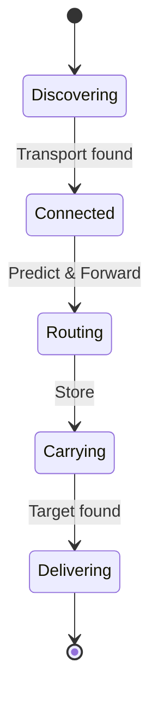

# RFC 004: GHOST Routing Layer (Layer 4)

## 1. Purpose
Store-carry-forward epidemic routing enhanced by on-device ML predictor. Predicts which mesh node is most likely to encounter the target recipient.

## 2. Interface Specification
```go
type Predictor interface {
    Predict(target NodeID, ttl time.Duration) float64
    TrainLocal(record EncounterRecord)
    GetUpdate() GradientUpdate
    MergeUpdate(update GradientUpdate)
}

type Router interface {
    RouteMessage(msg *Message) error
    RegisterTransport(transport Transport)
}

type MessageStore interface {
    Store(msg *Message) error
    Retrieve(id MessageID) (*Message, error)
    Delete(id MessageID) error
}

type EncounterLog interface {
    Log(record EncounterRecord) error
    GetRecent(limit int) ([]EncounterRecord, error)
}

type RoutingTable interface {
    Update(node NodeID, metrics RoutingMetrics) error
    Get(node NodeID) (RoutingMetrics, error)
}
```

## 3. Data Structures
- **Message**: id, src, dst, payload, ttl, hops, priority
- **EncounterRecord**: nodeA, nodeB, timestamp, duration, location_cluster, transport_type
- **GradientUpdate**: model_version, compressed_gradients, noise, node_count
- **RoutingMetrics**: historical success rate, prediction score

## 4. TinyML Predictor Architecture
- 200KB INT8 quantized neural network
- 3-layer: 12 input → 64 hidden → 32 hidden → 1 output (delivery probability)
- Input features: hour_of_day, day_of_week, location_cluster (4 features from cluster ID one-hot), mutual_contacts_count, meeting_frequency, avg_meeting_duration, transport_route_similarity, last_seen_hours_ago, message_ttl_remaining
- Training: on-device SGD with learning rate 0.001, batch size 16
- Inference: <1ms on target device

## 5. Epidemic Routing Algorithm
Base algorithm: spray-and-wait with L=8 copies.
Enhanced: predictor scores determine copy allocation.
```text
function RouteMessage(msg):
    if target_encountered:
        deliver(msg)
    else:
        score = Predictor.Predict(msg.dst)
        if score > threshold and copies > 1:
            allocate_copies(msg)
            forward(msg)
```

## 6. Federated Learning Protocol
- Gradient updates gossiped through mesh, never raw encounter data
- Differential privacy: Laplace noise with ε=1.0 added to each gradient
- Gradient compression: top-k 10% sparsification
- Aggregation: FedAvg weighted by node encounter count
- Convergence: update every 100 encounters or 24 hours

## 7. Exploration vs Exploitation
- ε-greedy with ε=0.1 (10% random carrier selection). Decay schedule. Multi-armed bandit formulation for transport selection.

## 8. Pre-positioning Algorithm
- Predictive message placement based on encounter patterns. Move messages to nodes likely to be in target's path.

## 9. Message Lifecycle
- States: Created, Queued, InTransit, Delivered, Expired, Failed.
- TTL management. Deduplication via Bloom filter (10KB, 0.1% FPR).

## 10. Security Model
- Routing privacy: node IDs are ephemeral.
- Anti-flooding: rate limiting per source.
- Gradient poisoning defense: median aggregation.

## 11. Performance Budget
- RAM: 5MB (model + message store)
- CPU: 2% idle / 10% routing
- Storage: 50MB message buffer
- Latency: <5ms routing decision

## 12. State Machine

