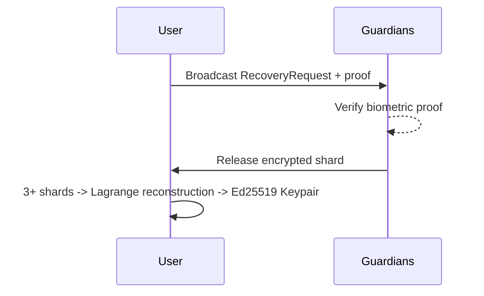
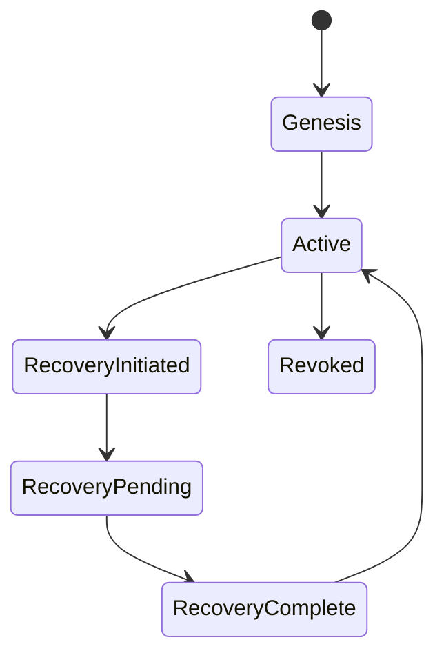

# RFC 005: GHOST Identity Layer (Layer 5)

## 1. Purpose
Decentralized identity management. No central authority. Identity recovery via Shamir's Secret Sharing with algorithmically selected guardians.

## 2. Interface Specification
```rust
pub trait IdentityManager {
    fn create_identity(&self, seed: BiometricSeed) -> GhostIdentity;
    fn recover_identity(&self, request: RecoveryRequest) -> GhostIdentity;
}

pub trait GuardianSelector {
    fn select_guardians(&self, context: &NetworkContext) -> [GuardianCandidate; 5];
}

pub trait RecoveryCeremony {
    fn initiate(&self, proof: IdentityProof) -> RecoveryRequest;
    fn process_response(&self, response: RecoveryResponse);
}

pub trait BiometricSeed {
    fn generate(voice: Voiceprint, gait: Gait, touch: Touch) -> Self;
}
```

## 3. Cryptographic Specification
- Shamir's Secret Sharing: (5,3) threshold scheme over prime field p = 2^256 - 189
- Polynomial evaluation in GF(p)
- Lagrange interpolation for reconstruction
- Biometric seed: Argon2id(voiceprint || gait || touch, salt=location_hash, memory=32MB, iterations=3)

## 4. Data Structures
```rust
pub struct GhostIdentity {
    pub public_key: Ed25519PublicKey,
    pub guardian_hashes: [Blake3Hash; 5],
    pub threshold: usize, // 3
}

pub struct Shard {
    pub x: u64,
    pub y: Vec<u8>, // encrypted to guardian's public key
}

pub struct GuardianCandidate { /* TODO */ }
pub struct RecoveryRequest { /* TODO */ }
pub struct RecoveryResponse { /* TODO */ }
pub struct BiometricTemplate { /* TODO */ }
pub struct IdentityProof { /* TODO */ }
```

## 5. Guardian Selection Algorithm
- Criteria: longest mutual connection history (>30 days), geographic diversity (different location clusters), uptime score (>80% online in last 30 days), not already guardian for >3 other identities
- Selection is deterministic given mesh state: sorted by composite score, top 5 selected
- Re-evaluation every 7 days, guardians rotated if criteria no longer met

## 6. Recovery Ceremony Protocol
Step 1: User broadcasts RecoveryRequest with biometric proof
Step 2: Guardians verify biometric (compare voiceprint similarity >0.85)
Step 3: Each guardian releases encrypted shard upon verification
Step 4: User collects 3+ shards, performs Lagrange reconstruction
Step 5: Derived secret regenerates Ed25519 keypair



## 7. Biometric Seed Generation
- Voiceprint: 128-dimensional MFCC feature vector from 10s recording
- Gait: accelerometer pattern over 50 steps, 64-dim feature vector
- Touch: pressure/velocity/area patterns, 32-dim feature vector
- Combined: concatenate → Argon2id → 256-bit seed
- Stability: fuzzy extraction with error-correcting codes (BCH)

## 8. Rate Limiting
- 30 days between recovery attempts. Guardian must have seen requester in last 90 days. Maximum 1 recovery per guardian per 30 days.

## 9. Security Model
- Guardian collusion: need 3/5 AND biometric. Biometric spoofing: multi-modal (voice+gait+touch) with liveness detection. Identity theft: rate limiting + biometric + guardian consensus.

## 10. Performance Budget
- Shamir split: <10ms. Reconstruction: <10ms. Argon2id: ~3s on target device. Biometric extraction: <2s. RAM: 40MB during Argon2id, 2MB otherwise.

## 11. State Machine


## 12. Contact Discovery & Exchange Addendum

### 12.1 Out-of-Band Key Exchange (Zero-TOFU)
- **Primary Mechanism:** In-person cryptographic QR scan.
- **Wire Format:** `GHOST:<Base64(Ed25519PublicKey(32) || X25519PublicKey(32) || DisplayName(UTF-8))>`
- **Reciprocal Verification:** Scanning peer QR automatically transitions local device to show QR code for reciprocal return scan. Both devices exchange signed wire packets over BLE, entering `MutuallyVerified` state (`🔒 ✔`).

### 12.2 Protest Mode Discovery (v0.3 Specification)
- **Nearby One-Tap Consent:** Discovered BLE 4-byte fingerprints trigger high-priority prompts. One-tap approval initiates mutual GATT key bundle exchange in <3 seconds without cameras.
- **24-Hour Rotating Short Codes:** `BIP-39[Seed(4)] || Nonce` derived from `HMAC-SHA256(PrivKey, EpochDay)` for verbal, sign, or radio exchange. Resolved via local mesh encounter cache.
