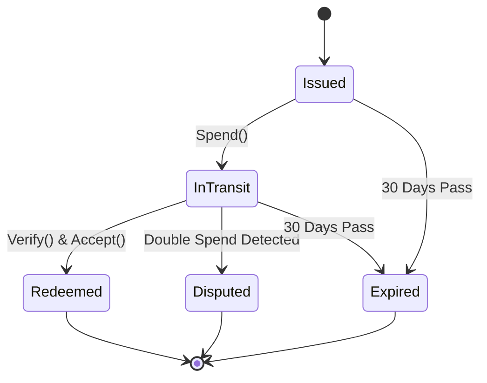

# GHOST Economy Layer RFC (Layer 6)
**Go package:** `ghost-economy`

## 1. Purpose
The purpose of the GHOST Economy Layer is to incentivize message forwarding and storage in the mesh without relying on a blockchain or central ledger. This is achieved through a credit-based economy utilizing Ghost Credits and a decentralized reputation scoring system.

## 2. Interface Specification

```go
type CreditManager interface {
    Issue(forwarder NodeID, bytes uint64) (*GhostCredit, error)
    Spend(credit *GhostCredit, recipient NodeID) error
    Balance(node NodeID) uint64
    Verify(credit *GhostCredit) bool
}

type ReputationManager interface {
    Score(node NodeID) float64
    UpdateEncounter(node NodeID, outcome EncounterOutcome)
    GetTopNodes(n int) []NodeID
}
```

## 3. Data Structures

```go
type GhostCredit struct {
    Issuer    NodeID
    Amount    uint64 // bytes forwarded
    Timestamp uint64
    Expiry    uint64 // 30 days
    Signature ed25519.Signature
}

type ReputationGraph struct {
    // PageRank-style reputation scores
    // Computed via gossip consensus
    Scores map[NodeID]float64
}

type CreditLedger struct {
    Balances map[NodeID]uint64
    Transactions []Transaction
}

type Transaction struct {
    Sender    NodeID
    Recipient NodeID
    Amount    uint64
    Timestamp uint64
    Signature ed25519.Signature
}

type EncounterOutcome struct {
    NodeID        NodeID
    Success       bool
    BytesVerified uint64
    Timestamp     uint64
}

type MarketState struct {
    CongestionLevel float64
    BaseFee         uint64
}

type PriceOracle struct {
    // Computes dynamic pricing based on MarketState
}
```

## 4. Credit Issuance Rules
- 1 GC per KB forwarded successfully (confirmed by receipt)
- 10 GC per MB stored per day (for store-and-forward messages)
- Bonus: 5 GC for first delivery of a message (incentivize last-mile)
- Credits expire after 30 days (prevents hoarding)

## 5. Credit Spending Rules
- 1 GC per KB sent (standard priority)
- 2 GC per KB sent (urgent/high priority)
- 0.5 GC per KB for broadcast messages
- New nodes start with 100 GC bootstrap credit

## 6. Sybil Resistance
- Biometric proof required (from Layer 5) to create identity
- Guardian attestation required (3/5 guardians must vouch)
- Rate limiting: max 10 new identities per guardian per year
- Trust score based on age + forwarding history + guardian quality

## 7. Reputation Consensus Algorithm
- Weighted PageRank on mesh encounter graph
- Edge weight = successful_forwards / total_encounters
- Damping factor d=0.85
- Gossip-based computation: each node computes local PageRank and gossips scores
- Convergence: scores stabilize after ~10 gossip rounds
- Update frequency: every 6 hours

**Pseudocode:**
```python
def compute_reputation(graph):
    d = 0.85
    N = len(graph.nodes)
    scores = {node: 1.0 / N for node in graph.nodes}
    
    for _ in range(MAX_ITERATIONS):
        new_scores = {}
        for node in graph.nodes:
            sum_incoming = 0
            for neighbor in graph.incoming_edges(node):
                weight = neighbor.successful_forwards / neighbor.total_encounters
                sum_incoming += (scores[neighbor.id] * weight) / len(graph.outgoing_edges(neighbor))
            new_scores[node] = (1 - d) / N + d * sum_incoming
            
        if converged(scores, new_scores):
            break
        scores = new_scores
    return scores
```

## 8. Credit Verification
- Ed25519 signature verification on all credits and transactions.
- Double-spend prevention via local Bloom filter + gossip-based invalidation.
- Credit chain validation to ensure the lineage of credits is intact.

## 9. Garbage Collection
- Expired credits purged every 24h.
- Ledger compaction: summarize old transactions into balance snapshots.
- Storage budget: <5MB per node.

## 10. Market Dynamics
- Dynamic pricing based on network congestion.
- Price discovery via gossip.
- Bandwidth auction for premium routes.

## 11. Security Model
- **Double-spending:** Gossip-based detection + severe reputation penalty.
- **Credit forgery:** Ed25519 signatures prevent unauthorized issuance.
- **Inflation:** Expiry (30 days) + strict issuance caps.
- **Free-riding:** Minimum reputation threshold required to send messages.

## 12. Performance Budget
- **RAM:** 2MB for ledger
- **CPU:** 1% for credit operations
- **Storage:** 5MB max ledger
- **Latency:** <1ms for credit verification

## 13. State Machine


