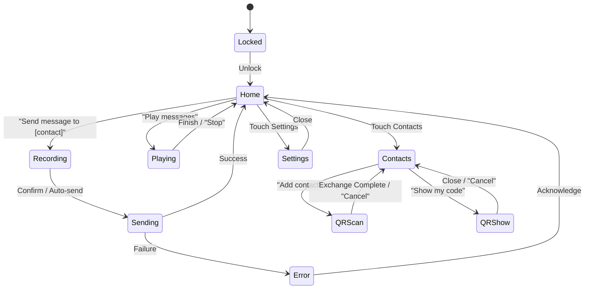

# GHOST Application Layer RFC (Layer 7)
**Kotlin module:** `app/`

## 1. Purpose
The purpose of the GHOST Application Layer is to provide an accessible Android application targeting low-literacy users on $30 Android phones. It features a voice-first interaction model, minimal visual UI with large icons, and distinct haptic feedback to serve environments where traditional text interfaces fall short.

## 2. Requirements
- Voice input for recipient selection and message composition (on-device Vosk or Whisper Tiny, ~40MB model)
- TTS for message playback (Android built-in TTS engine)
- Haptic sender identification (Morse code vibration patterns unique per contact)
- QR code contact exchange (camera-based, no internet needed)
- Background foreground service with wake locks
- Doze mode bypass via `REQUEST_IGNORE_BATTERY_OPTIMIZATIONS`
- Target: Android 8.0+ (API 26+), 1GB RAM, 8GB storage, no Google Play Services

## 3. Interface Specification
**Kotlin classes:**
- `GhostService`: Foreground service for continuous mesh operations
- `VoiceController`: Speech recognition and intent parsing
- `HapticController`: Generation and playback of vibration patterns
- `QRExchange`: QR code generation and scanning
- `MessageComposer`: Managing audio/text recording and sending
- `ContactManager`: Local contact and identity management

## 4. UI State Machine
State transitions are primarily driven by voice commands and specific touch events.

## 5. Voice Command Grammar
- **"Send message to [contact]"** → Transitions to `Recording` state
- **"Play messages"** → Transitions to `Playing` state
- **"Add contact"** → Transitions to `QRScan` state
- **"Show my code"** → Transitions to `QRShow` state
- **"Stop" / "Cancel"** → Transitions to `Home` state
- **"Status"** → Reads mesh status via TTS
- *Support for multiple languages (Vosk models)*

## 6. Haptic Sender Identification
- Each contact assigned a unique Morse-like vibration pattern.
- Pattern generated from a hash of the contact's public key.
- 3-character pattern (dot=100ms, dash=300ms, gap=200ms).
- Allows the user to feel who sent a message without looking at the screen.

## 7. Background Service Lifecycle
- `START_STICKY` foreground service with persistent notification.
- Wake locks utilized for BLE scanning and mesh operations.
- Doze mode bypassed via `REQUEST_IGNORE_BATTERY_OPTIMIZATIONS`.
- Battery optimization: adaptive scan intervals based on activity.
- Service restart on crash via `AlarmManager`.

## 8. Notification Strategy
- **Foreground service notification:** Mesh status (connected nodes, pending messages).
- **New message notification:** Haptic pattern + optional TTS readout.
- **Urgent message:** Repeated vibration + high-priority visual notification.
- **Silent mode:** Haptic only, no sound.

## 9. Accessibility Compliance
- TalkBack compatible out of the box.
- Minimum touch target: 48dp.
- High contrast colors.
- No text-only interactions (everything has a voice/haptic alternative).
- RTL layout support.

## 10. QR Code Contact Exchange Protocol
- **QR contains:** public key + display name + optional avatar hash.
- **Mutual scan:** both parties scan each other's QR.
- **Verification:** both devices vibrate the same pattern to confirm identity.
- **Offline-only:** no network needed.

## 11. Jetpack Compose UI Architecture
- Single Activity with Compose navigation.
- ViewModels for each screen maintaining UI state.
- State hoisting pattern for centralized state management.
- Theme: dark mode default, high contrast.

## 12. FFI Bridge
- **Kotlin to Rust/Go:** JNI for Rust, `gomobile` for Go.
- **Thread safety:** Dedicated background threads for FFI calls; callbacks marshal to the main thread.
- **Memory management:** Strict object lifecycle tracking; native memory freed via Kotlin `AutoCloseable` or finalizers.

## 13. Security Model
- Screen lock integration for sensitive operations.
- Notification content hiding on lock screen.
- Secure storage for keys: Android Keystore where available, encrypted file fallback on older devices.

## 14. Performance Budget
- **APK size:** <50MB (including Vosk model).
- **RAM:** <80MB runtime.
- **Cold start:** <3s.
- **Voice recognition latency:** <500ms.
- **Battery:** <5% per day in idle mesh mode.

## 15. State Machine Diagram
(Refer to the mermaid diagram in Section 4 for the complete flow of UI states and transitions.)

## 16. Tactical UI & Security State Extensions (v0.3.x)
- **Security Posture HUD:** Compact header indicator and quick switch for `NORMAL`, `PROTEST`, `EMERGENCY`, and `STEALTH` modes with battery fail-safe (15% revert).
- **Cell Groups (v0.3.5):** Hexagon avatars with deterministic hue, hard 2–8 member cap, verified-only contact picker, and quoted swipe-to-reply.
- **Delivery Receipts (v0.3.7):** GhostPurple double checkmark (`✓✓`) for verified Room DB storage (`STATUS_DELIVERED = 2`); live `Delivered to X/Y` group tally with modal member detail sheet.
- **Trust Web & Introductions (v0.3.6):** Distinct visual state for introduced peers (slate avatar border `#3F3F46`, `"INTRODUCED"` chip) without granting the violet Ghost Aura; persistent top banner in chat with one-tap transition to reciprocal QR verification.

